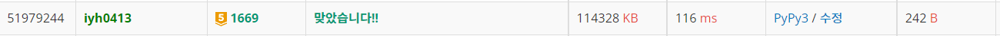

# [Baekjoon] 1669. 멍멍이 쓰다듬기 [G5]

## 📚 문제 : [멍멍이 쓰다듬기](https://www.acmicpc.net/problem/1669)

## 📖 풀이

원숭이와 멍멍이의 키가 같아야 한다. 시작일과 끝 일은 무조건 1이다.

음 점화식으로 풀면 될거 같으니 각 키 차이 별로 최소 날짜를 찾아본다.

```
1cm : 1 => 1일
2cm : 1 1 => 2일
3cm : 1 1 1 => 3일
4cm : 1 2 1 => 3일
5cm : 1 1 2 1 => 4일
6cm : 1 2 2 1 => 4일
7cm : 1 1 2 2 1 => 5일
8cm : 1 2 2 2 1 => 5일
9cm : 1 2 3 2 1 => 5일
10cm : 1 2 3 2 1 1 => 6일
11cm : 1 2 3 2 2 1 => 6일
12cm : 1 2 3 3 2 1 => 6일
```

최대 날짜 순으로 찾아보면 아래와 같다.

> 1 + 1 + 2 + 2 + 3 + 3 + ... 로 더해가며 키 차이보다 값이 커지는 경우 종료하고 더한 수의 개수를 센다.

차이가 20인 경우는

> 1 + 1 + 2 + 2 + 3 + 3 + 4 + 4 이므로 8번 더했으니 8일이다.

23인 경우는

> 1 + 1 + 2 + 2 + 3 + 3 + 4 + 4가 20이고 5을 더하면 25이다. 그러면 하루를 더해서 9일로 세면 된다.

## 📒 코드

```python
def solve():
    dif = b - a
    day = 0
    for i in range(1, 2 ** 31):
        for _ in range(2):
            if dif <= 0:
                return day
            day += 1
            dif -= i


a, b = map(int, input().split())
print(solve())
```

## 🔍 결과


