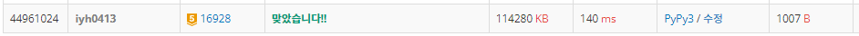

# [Baekjoon] 16928. 뱀과 사다리 게임 [G5]

## 📚 문제 : [뱀과 사다리 게임](https://www.acmicpc.net/problem/16928)

## 📖 풀이

100번 칸에 도착하면 종료한다.

사다리와 뱀은 양방향이 아니라 단방향이다. 

- 사다리는 더 큰 수로만 이동한다. 
- 뱀은 더 작은 칸으로 이동한다.

1부터 시작해서 100까지 도달하는 최소값을 찾아보자!

최소값을 찾는 문제이니 **BFS**로 해결한다.

1. 1을 큐에 담는다. visited 배열에 1을 표시한다.
2. 큐에서 값을 꺼내, 1 ~ 6을 더해 그 때 연결된 사다리나 뱀을 통과하고 최종 도착점을 구한다.
   - 최종 도착점을 구하기 위해 **DFS**를 활용한다.
   - 방문하지 않았던 정점이면 도착점을 visited 배열에 표시하고, 다음 큐에 담는다.
3. 100이 나오면 그 때의 cnt를 출력한다.
   - cnt 값을 확인하기 위해 같은 level만큼만 순회한다.
   - 같은 레벨을 순회하기 위해 for문으로 while문의 시작부분에 que에 있던 개수 만큼만 돌려준다.

100이 나오면 그 때 출력하고 종료한다.

## 📒 코드

```python
from collections import deque


def dfs(node):              # 이동
    if arr[node]:           # 이동한 노드에 사다리나 뱀이 있는 경우
        node = dfs(arr[node])           # 이동시킨다.
    if visited[node]:       # 확인했던 번호인지 체크
        return False
    else:
        return node


n, m = map(int, input().split())        # n : 사다리 개수, m : 뱀 개수
visited = [0 for _ in range(110)]
arr = [0 for _ in range(110)]           # 현재 칸에서 이동하는 좌표를 적는다. 없는 경우는 0
for _ in range(n + m):
    x, y = map(int, input().split())
    arr[x] = y

que = deque()
que.append(1)
visited[1] = 1
cnt = 0
while que:
    for _ in range(len(que)):   # 현재 같은 레벨만큼만 시행
        v = que.popleft()
        if v == 100:
            print(cnt)
            exit()
        for i in range(1, 7):
            nxt = dfs(v + i)
            if nxt:
                visited[nxt] = 1
                que.append(nxt)
    cnt += 1
```

## 🔍 결과

