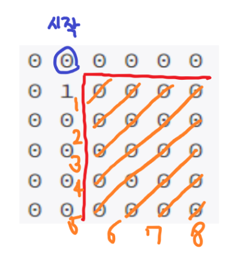
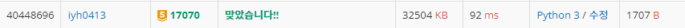

# [Baekjoon] 17070. 파이프 옮기기 1 [G5]

## 📚 문제

https://www.acmicpc.net/problem/17070

---

**BFS**로 풀어본다. 음.. 중복된 값들이 있어 시간초과가 발생할 것 같다. 메모이제이션을 활용할 수 있지만 일단 BFS로만 풀면 쉬우니 한 번 풀어본다.

시작점을 큐에 넣는다. 이 때 방향도 함께 넣어준다. [y, x, 방향]

방향은 0이 오른쪽, 대각선이 1, 아래가 2이다.

큐에서 꺼낸 좌표의 방향이 오른쪽이면 오른쪽과 대각선 방향의 좌표와 방향 값을 큐에 넣어주고, 대각선이면 모든 방향을 큐에 넣는다. 그리고 아래쪽이면 대각선과 아래 방향으로 큐에 넣는다.

값이 n-1, n-1에 도달하는 경우 결과 cnt 값을 1씩 증가시킨다.

인덱스 초과 범위만 설정하면 쉽게 코드를 작성할 수 있다.

## 📒 BFS 코드 - 시간 초과

```python
from collections import deque


n = int(input())
arr = [list(map(int, input().split())) for _ in range(n)]
dp = [[[-1, -1, -1] for _ in range(n)] for _ in range(n)]
queue = deque()
queue.append((0, 1, 0))   # 시작점의 좌표와 방향, 방향은 오른쪽 0, 대각선 1, 아래 2
result = 0

while queue:
    v = queue.popleft()
    if v[0] == n - 1 and v[1] == n - 1: # 끝에 도착한 경우 cnt 증가
        result += 1
    
    if v[2] != 2 and v[1] < n - 1 and arr[v[0]][v[1] + 1] == 0:  # 아래 방향이 아니면 오른쪽으로 이동 가능, 인덱스 초과하지 않게, 이동한 곳에 벽이 없는 경우
        queue.append((v[0], v[1] + 1, 0))
    if v[2] != 0 and v[0] < n - 1 and arr[v[0] + 1][v[1]] == 0:  # 오른쪽 방향이 아니면 아래로 이동 가능, 인덱스 초과하지 않게, 이동한 곳에 벽이 없는 경우
        queue.append((v[0] + 1, v[1], 2))
    if v[0] < n - 1 and v[1] < n - 1:   # 대각선은 모두 이동가능하며, 인덱스 초과 범위만 설정
        if arr[v[0] + 1][v[1] + 1] == 0 and arr[v[0]][v[1] + 1] == 0 and arr[v[0] + 1][v[1]] == 0:  # 대각선은 세방향 다 벽이 없어야 한다.
            queue.append((v[0] + 1, v[1] + 1, 1))   # 대각선은 어떤 경우라도 가능

print(result)
```

## 🔍 결과 - 시간초과


예상대로 시간초과가 발생한다.

---

**BFS 탐색에 DP**를 섞어서  푼다.

세 방향으로 **메모이제이션** 배열을 만들기 위해 3차원으로 선언한다. [오른쪽, 대각선, 아래]

확인할 인덱스의 경우의 수는 [[왼쪽의 오른쪽, 대각선 값], [대각선의 모든 값], [위쪽의 대각선, 아래 값]]으로 값을 넣어줄 수 있다.

그림과 표로 설명해본다.

### 벽이 없는 경우

- Input

  > 6
  > 0 0 0 0 0 0
  > 0 0 0 0 0 0
  > 0 0 0 0 0 0
  > 0 0 0 0 0 0
  > 0 0 0 0 0 0
  > 0 0 0 0 0 0

먼저 기저조건을 채워주기 위해 위쪽과 왼쪽의 사이드를 다 채워준다.

첫 번째 행에서 시작점 오른쪽으로 [1, 0, 0]을 채우는데 벽을 만나면 그 이후는 [0, 0, 0]으로 채운다.

시작점을 제외한 왼쪽부터 0, 1 열들은 절대 갈 수 없으니 [0, 0, 0]으로 채운다.

| 0, 0, 0 | 1, 0, 0 | 1, 0, 0 | 1, 0, 0 | 1, 0, 0 | 1, 0, 0 |
| ------- | ------- | ------- | ------- | ------- | ------- |
| 0, 0, 0 | 0, 0, 0 |         |         |         |         |
| 0, 0, 0 | 0, 0, 0 |         |         |         |         |
| 0, 0, 0 | 0, 0, 0 |         |         |         |         |
| 0, 0, 0 | 0, 0, 0 |         |         |         |         |
| 0, 0, 0 | 0, 0, 0 |         |         |         |         |

확인했던 건 더 확인하지 않기 위해 대각선 방향으로 채워나간다.



따라서 큐를 활용해 (1, 2) 인덱스부터 시작한다.

1. (1, 2)의 0번째 인덱스 값은 왼쪽인 (1, 1)의 오른쪽 방향과 대각선 방향의 값을 더해준다. 둘 다 0이므로 0이다.
2. (1, 2)의 1번째 인덱스 값은 대각선인 (0, 1)의 모든 인덱스를 더한 값이다. 따라서 1이다.
3. (1, 2)의 2번째 인덱스 값은 위쪽인 (0, 2)의 대각선, 아래 방향의 값을 더해준다. 둘 다 0이므로 0이다.

| 0, 0, 0 | 1, 0, 0 | 1, 0, 0 | 1, 0, 0 | 1, 0, 0 | 1, 0, 0 |
| ------- | ------- | ------- | ------- | ------- | ------- |
| 0, 0, 0 | 0, 0, 0 | 0, 1, 0 |         |         |         |
| 0 ,0 ,0 | 0, 0, 0 |         |         |         |         |
| 0, 0, 0 | 0, 0, 0 |         |         |         |         |
| 0, 0, 0 | 0, 0, 0 |         |         |         |         |
| 0, 0, 0 | 0, 0, 0 |         |         |         |         |

그 다음 대각선을 채운다. 이 땐 델타 탐색으로 확인한 좌표의 오른쪽 왼쪽의 값을 큐에 넣어준다.

(1, 2)의 오른쪽인 (1, 3)과 아래쪽인 (2, 2) 좌표의 값을 채워준다.

위 과정을 똑같이 반복한다.

| 0, 0, 0 | 1, 0, 0 | 1, 0, 0 | 1, 0, 0 | 1, 0, 0 | 1, 0, 0 |
| ------- | ------- | ------- | ------- | ------- | ------- |
| 0, 0, 0 | 0, 0, 0 | 0, 1, 0 | 1, 1, 0 |         |         |
| 0 ,0 ,0 | 0, 0, 0 | 0, 0, 1 |         |         |         |
| 0, 0, 0 | 0, 0, 0 |         |         |         |         |
| 0, 0, 0 | 0, 0, 0 |         |         |         |         |
| 0, 0, 0 | 0, 0, 0 |         |         |         |         |

여기서는 (3, 2) 좌표처럼 두 번 큐에 담기는 중복된 값이 존재하는데 이때 확인한 값이나 인덱스를 초과한 값은 버린다.

| 0, 0, 0 | 1, 0, 0 | 1, 0, 0 | 1, 0, 0 | 1, 0, 0 | 1, 0, 0 |
| ------- | ------- | ------- | ------- | ------- | ------- |
| 0, 0, 0 | 0, 0, 0 | 0, 1, 0 | 1, 1, 0 | 2, 1, 0 |         |
| 0 ,0 ,0 | 0, 0, 0 | 0, 0, 1 | 0, 1, 1 |         |         |
| 0, 0, 0 | 0, 0, 0 | 0, 0, 1 |         |         |         |
| 0, 0, 0 | 0, 0, 0 |         |         |         |         |
| 0, 0, 0 | 0, 0, 0 |         |         |         |         |


| 0, 0, 0 | 1, 0, 0 | 1, 0, 0 | 1, 0, 0 | 1, 0, 0 | 1, 0, 0 |
| ------- | ------- | ------- | ------- | ------- | ------- |
| 0, 0, 0 | 0, 0, 0 | 0, 1, 0 | 1, 1, 0 | 2, 1, 0 | 3, 1, 0 |
| 0 ,0 ,0 | 0, 0, 0 | 0, 0, 1 | 0, 1, 1 | 1, 2, 1 |         |
| 0, 0, 0 | 0, 0, 0 | 0, 0, 1 | 0, 1, 2 |         |         |
| 0, 0, 0 | 0, 0, 0 | 0, 0, 1 |         |         |         |
| 0, 0, 0 | 0, 0, 0 |         |         |         |         |


| 0, 0, 0 | 1, 0, 0 | 1, 0, 0 | 1, 0, 0 | 1, 0, 0 | 1, 0, 0 |
| ------- | ------- | ------- | ------- | ------- | ------- |
| 0, 0, 0 | 0, 0, 0 | 0, 1, 0 | 1, 1, 0 | 2, 1, 0 | 3, 1, 0 |
| 0 ,0 ,0 | 0, 0, 0 | 0, 0, 1 | 0, 1, 1 | 1, 2, 1 | 3, 3, 1 |
| 0, 0, 0 | 0, 0, 0 | 0, 0, 1 | 0, 1, 2 | 1, 2, 3 |         |
| 0, 0, 0 | 0, 0, 0 | 0, 0, 1 | 0, 1, 3 |         |         |
| 0, 0, 0 | 0, 0, 0 | 0, 0, 1 |         |         |         |


| 0, 0, 0 | 1, 0, 0 | 1, 0, 0 | 1, 0, 0 | 1, 0, 0 | 1, 0, 0 |
| ------- | ------- | ------- | ------- | ------- | ------- |
| 0, 0, 0 | 0, 0, 0 | 0, 1, 0 | 1, 1, 0 | 2, 1, 0 | 3, 1, 0 |
| 0 ,0 ,0 | 0, 0, 0 | 0, 0, 1 | 0, 1, 1 | 1, 2, 1 | 3, 3, 1 |
| 0, 0, 0 | 0, 0, 0 | 0, 0, 1 | 0, 1, 2 | 1, 2, 3 | 3, 4, 4 |
| 0, 0, 0 | 0, 0, 0 | 0, 0, 1 | 0, 1, 3 | 1, 3, 5 |         |
| 0, 0, 0 | 0, 0, 0 | 0, 0, 1 | 0, 1, 4 |         |         |

마지막 과정은 생략해서 함께 적는다.

다음과 같이 마지막이 인덱스가 채워지면 종료한다.

| 0, 0, 0 | 1, 0, 0 | 1, 0, 0 | 1, 0, 0 | 1, 0, 0 | 1, 0, 0  |
| ------- | ------- | ------- | ------- | ------- | -------- |
| 0, 0, 0 | 0, 0, 0 | 0, 1, 0 | 1, 1, 0 | 2, 1, 0 | 3, 1, 0  |
| 0 ,0 ,0 | 0, 0, 0 | 0, 0, 1 | 0, 1, 1 | 1, 2, 1 | 3, 3, 1  |
| 0, 0, 0 | 0, 0, 0 | 0, 0, 1 | 0, 1, 2 | 1, 2, 3 | 3, 4, 4  |
| 0, 0, 0 | 0, 0, 0 | 0, 0, 1 | 0, 1, 3 | 1, 3, 5 | 4, 6, 8  |
| 0, 0, 0 | 0, 0, 0 | 0, 0, 1 | 0, 1, 4 | 1, 4, 8 | 5, 9, 14 |

5, 9, 14를 다 더한 값인 28이 답이다.

위 과정은 벽을 생각 안했을 때 해결과정이다.


### 벽이 있는 경우

큐에서 값을 꺼내 인덱스에 값을 넣어줄 때, 왼쪽과 왼쪽 위와 위의 좌표에 벽이 있는지 확인한다.

1. 왼쪽에 벽이 있는 경우는 가로방향과 대각선 값이 0이다. [0, 0, ?]
2. 위에 벽이 있는 경우는 세로방향과 대각선 값이 0이다. [?, 0, 0]
3. 대각선에 벽이 있는 경우는 대각선 값이 0이다. [?, 0, 0]

다음 과정을 값을 넣어줄 때 고려하여 해결한다.

그리고 우리가 확인할 n-1, n-1 인덱스에 벽이 있는 경우는 바로 0을 출력한다.

## 📒 BFS + DP 코드

```python
from collections import deque


n = int(input())
arr = [list(map(int, input().split())) for _ in range(n)]
dp = [[[-1, -1, -1] for _ in range(n)] for _ in range(n)] # 방향마다 경우의 수를 적어준다. 오른쪽, 대각선, 아래

for i in range(n):
    for j in range(2):
        dp[i][j] = [0, 0, 0]    # 갈 수 없는 왼쪽부터 두 칼럼에 [0, 0, 0]을 넣어준다.

dp[0][1] = [1, 0, 0]        # 시작점, (0, 1)에서 오른쪽 방향
for i in range(2, n):       # 첫 번째 행에 값을 넣어준다.
    if arr[0][i]:
        dp[0][i] = [0, 0, 0]    # 중간에 0을 만나면 그 오른쪽은 다 0으로 처리
    else:
        dp[0][i] = dp[0][i - 1]

if arr[n-1][n-1] == 1:      # 벽이 n-1, n-1에 있는 경우
    dp[n-1][n-1] = [0, 0, 0]

queue = deque()
queue.append((1, 2))
while queue and dp[n-1][n-1][0] == -1:
    v = queue.popleft()
    y, x = v[0], v[1]

    if y == n or x == n or dp[y][x][0] != -1:   # 인덱스를 초과하거나 이미 확인한 값이면 보지 않는다.
        continue

    # 왼쪽에서 오른쪽 방향에서 왔을 때
    if arr[y][x-1]:    # 왼쪽에 벽이 있는 경우
        dp[y][x][0] = 0
    else:   # 왼쪽의 값 중 대각선, 오른쪽 방향으로 온 값을 더한다.
        dp[y][x][0] = dp[y][x-1][0] + dp[y][x-1][1] 
    # 대각선 방향으로 왔을 때
    if arr[y][x-1] or arr[y-1][x-1] or arr[y-1][x]: # 왼쪽, 대각선, 위쪽으로 벽이 있는 경우
        dp[y][x][1] = 0
    else:   # 왼쪽 위의 값 세 개를 다 더한다.
        dp[y][x][1] = sum(dp[y-1][x-1]) 
    # 위쪽에서 아래 방향으로 왔을 때
    if arr[y-1][x]:     # 위쪽에 벽이 있는 경우
        dp[y][x][2] = 0
    else:   # 위쪽의 값 중 대각선, 아래 방향으로 온 값을 더한다.
        dp[y][x][2] = dp[y-1][x][1] + dp[y-1][x][2] 

    queue.append((y, x + 1))
    queue.append((y + 1, x))
    queue.append((y + 1, x + 1))

if dp[n-1][n-1][0] == -1:   # 도착점에 도달하지 못한 경우 0 출력
    print(0)
else:
    print(sum(dp[n-1][n-1]))
```

## 🔍 결과

