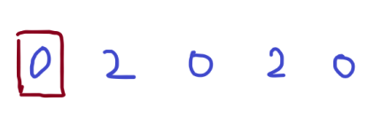
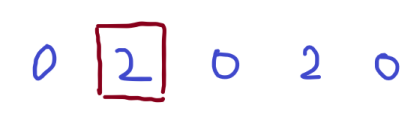
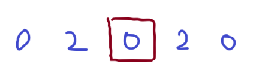
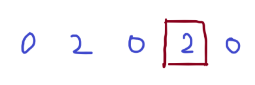
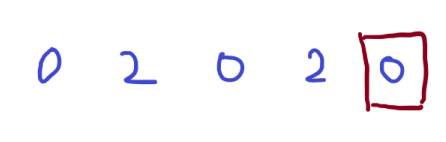
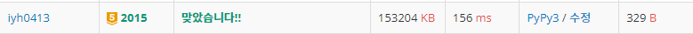

# [Baekjoon] 2015. 수들의 합 4 [G5]

## 📚 문제

https://www.acmicpc.net/problem/2015

---

**누적합**을 활용한다.

**딕셔너리**를 활용해 이전 값들을 저장해준다. 왜냐면 현재 값들과 이전 값의 차이를 활용해야 하기 때문이다. 카운팅 배열을 사용할 수도 있지만 합이 2,000,000,000을 넘으니 사용하기 어렵다.


그림으로 생각해보자.

예제 1번을 보면

- Input

```
4 0
2 -2 2 -2
```

위 같이 Input이 주어졌다.

누적합으로 표현하면 다음과 같다. 처음 padding을 넣어준다.

> 0 2 0 2 0

부분합이 0인 걸 찾아야 한다.



1. 첫 번째 인덱스부터 확인하며 이전 값들 중 현재 누적합과의 차이가 0인 것이 있는지 찾는다.

   처음은 없으므로 딕셔너리에 담는다.

   cnt = 0 prefix_cnt = {0:1}



2. 두 번째 인덱스는 2이다. 2에서 차이가 0이려면 이전에 있는 값이 2여야 한다. 2가 나오지 않았으므로 cnt를 증가시키지 않는다.

   그리고 딕셔너리에 담는다.

   cnt = 0 prefix_cnt = {0:1, 2:1}



3. 세 번째 인덱스는 0이다. 따라서 이전에 0이 몇 개 있는지 찾는다.

   0이 하나 있으므로 cnt를 1 증가시킨다.

   그리고 딕셔너리에 담는다.

   cnt = 1 prefix_cnt = {0:2, 2:1}



4. 네 번째 인덱스는 2이다. 따라서 이전에 2가 몇 개 있는지 찾는다. 2가 하나 있으므로 cnt를 1 증가시킨다.

   그리고 딕셔너리에 담는다.

   cnt = 2 prefix_cnt = {0:2, 2:2}



5. 다섯 번째 인덱스는 0이다. 따라서 이전에 0이 몇 개 있는지 찾는다. 0이 2개 있으므로 cnt를 2 증가시킨다.

   그리고 딕셔너리에 담는다.

   cnt = 4 prefix_cnt = {0:3, 2:2}

## 📒 코드

```python
n, k = map(int, input().split())
arr = [0] + list(map(int, input().split()))
prefix_cnt = {}                 # 딕셔너리 활용

for i in range(1, n + 1):       # 누적합
    arr[i] += arr[i - 1]

ans = 0
for i in range(n + 1):          
    ans += prefix_cnt.get(arr[i] - k, 0)        # 이전에 나온 값들 중 차이가 k인 것의 개수를 ans에 더한다.
    prefix_cnt[arr[i]] = prefix_cnt.get(arr[i], 0) + 1     # 딕셔너리에 현재 값의 개수를 하나 늘린다.

print(ans)
```

## 🔍 결과



