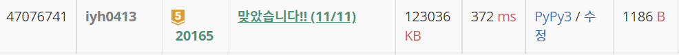

# [Baekjoon] 20165. 인내의 도미노 장인 호석 [G5]

## 📚 문제 : [인내의 도미노 장인 호석](https://www.acmicpc.net/problem/20165)

## 📖 풀이

구현문제이다. visited 배열을 만들어 도미노가 넘어졌는지 세워졌는지 확인한다.

동서남북을 쉽게 설정하기 위해 딕셔너리를 활용해 dx, dy 방향을 잡아준다.

공격할 때 시작 도미노의 길이에 맞춰 3이면 두 도미노를 쓰러뜨린다. 이 때 쓰러뜨리는 건 다시 재귀함수를 호출한다.

도미노가 세워져있으면 넘어뜨리는 로직을 수행하고 눕혀있으면 바로 리턴한다.

점수를 세야하므로 넘어진 도미노의 개수를 세서 더해준다.

공격 수비가 다 끝나고 0과 1을 S와 F로 바꿔 출력한다.

## 📒 코드

```python
def in_range(x, y):                     # 범위 넘어서는지 확인
    return 0 <= x < n and 0 <= y < m


def attack(x, y, d):
    if visited[x][y]:                   # 넘어진 도미노는 넘어뜨릴 수 없다.
        return 0
    
    visited[x][y] = 1                   # 현재 위치의 도미노는 넘어진다.
    cnt = 1
    for _ in range(arr[x][y] - 1):
        x += dx[dir[d]]
        y += dy[dir[d]]
        if not in_range(x, y):          # 범위 넘어서면 종료
            break
        cnt += attack(x, y, d)          # 다음 도미노들이 넘어지는 건 재귀로 구현
    return cnt
        

n, m, r = map(int, input().split())
arr = [list(map(int, input().split())) for _ in range(n)]   # 도미노 높이
visited = [[0] * m for _ in range(n)]       # 넘어졌는지 확인, 넘어졌으면 1, 아니면 0
# 동서남북
dir = {'E': 0, 'W': 1, 'S': 2, 'N': 3}
dx = [0, 0, 1, -1]                  # 순서대로 0(E) W(1) S(2) N(3)
dy = [1, -1, 0, 0]

score = 0
for i in range(r):
    # 공격
    x, y, d = input().split()
    x, y = int(x) - 1, int(y) - 1   # 격자판이 1부터 n까지이므로 1씩 빼준다.
    score += attack(x, y, d)        # 점수를 더해준다.
    # 수비
    x, y = map(lambda x: int(x) - 1, input().split())       # 격자판이 1부터 n까지이니 1씩 뺀다.
    visited[x][y] = 0               # 눕혀져있는 걸 세워준다.

print(score)                        # 점수 출력

# 게임판 상태 출력
for i in range(n):
    for j in range(m):
        if visited[i][j] == 0:      # 세워져있는 건 S
            visited[i][j] = 'S'
        else:                       # 눕혀져있는 건 F
            visited[i][j] = 'F'

for i in range(n):                  # 게임판 상태를 출력한다.
    print(*visited[i])
```

## 🔍 결과


