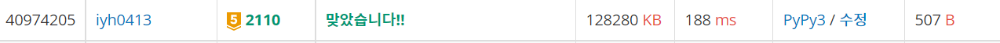

# [Baekjoon] 2110. 공유기 설치 [G5]

## 📚 문제

https://www.acmicpc.net/problem/2110

---

거리를 가능한 크게 설치하라는 문제이다. 문제만 봐도 매개변수탐색(이진탐색)을 사용할 수 있을 것 같다.

그럼 가능한지 예제로 확인해본다.

- Input

```
5 3
1
2
8
4
9
```

집의 좌표는 1, 2, 8, 4, 9이다.

좌표를 먼저 정렬한다. 1 2 4 8 9이다.

거리에 대한 매개변수를 표로 정리해보자!

| 거리     | 1    | 2    | 3    | 4    | 5    | 6    | 7    | 8    | 9    | 10   |
| -------- | ---- | ---- | ---- | ---- | ---- | ---- | ---- | ---- | ---- | ---- |
| 가능여부 | o    | o    | o    | x    | x    | x    | x    | x    | x    | x    |

다음과 같이 이진탐색을 활용하기 좋게 나타난다.

특정 거리로 공유기를 다 설치할 수 있는지 확인해서, 가능하면 s를 mid + 1로 바꾸고 불가능하면 e를 mid -1로 바꾼다.

이진탐색을 하기 위해 공유기 거리가 나올 수 있는 범위는`[1, 1_000_000_000]`이니 s와 e를 각각 1, 1_000_000_000로 설정한 후 시작한다.

## 📒 코드

```python
import sys
input = sys.stdin.readline

def check(x):
    cnt = c - 1         # 시작점에 공유기를 넣는다.
    now = arr[0]        # 공유기 값은 현재 시작점
    for i in range(1, n):
        if arr[i] - now >= x:   # x보다 크거나 같은 거리만큼 떨어졌는지 확인
            cnt -= 1
            if cnt == 0:        # 공유기를 다 넣었으면 True 리턴
                return True
            now = arr[i]
    return False                # 공유기를 다 넣지 못하면 False 리턴

n, c = map(int, input().split())
arr = sorted([int(input()) for _ in range(n)])  # 입력을 정렬한다.

ans = 0
s, e = 1, 1_000_000_000
while s <= e:               # 이진 탐색
    mid = (s + e) // 2
    if check(mid):
        s = mid + 1
        ans = mid
    else:
        e = mid - 1

print(ans)
```

## 🔍 결과

