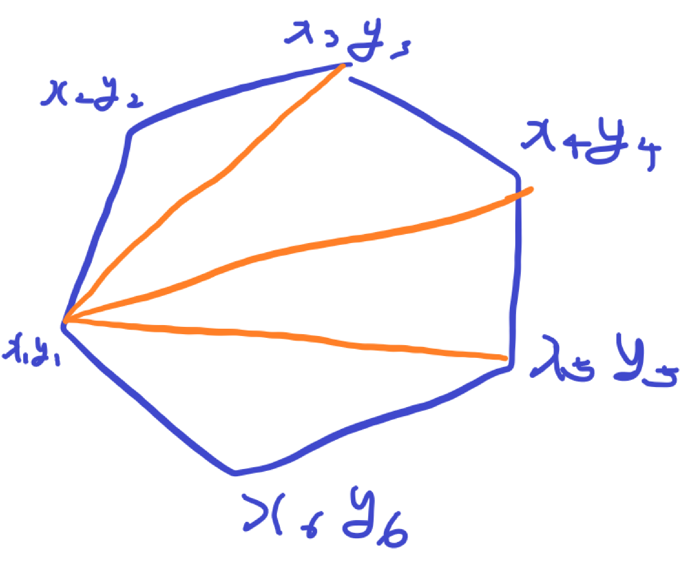
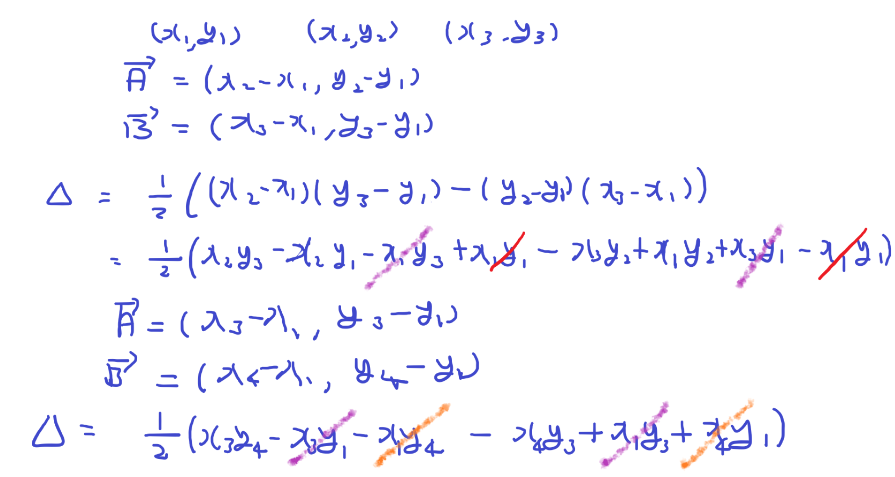
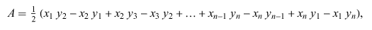
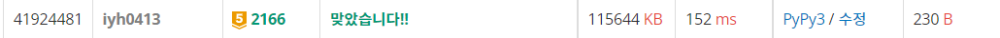

# [Baekjoon] 2166. 다각형의 면적 [G5]

## 📚 문제

https://www.acmicpc.net/problem/2166

---

## 📖 풀이

벡터의 외적을 활용해서 다각형의 넓이를 구해준다.

삼각형의 면적을 구할 땐 두 벡터를 외적한 값을 2로 나누어 구할 수 있다.

그러면 다각형을 삼각형으로 쪼개 외적으로 면적을 구한 다음 더하면 된다.


삼각형을 외적으로 구하는 방법을 그림판에 그려서 설명해본다.(~~글씨가 좀 더럽다.~~)

다각형이 다음과 같이 주어진다고 하면 삼각형으로 나누면 된다.



어떤 다각형이 들어오던 x1, y1을 기준으로 삼각형을 다 나누어준다.

---

아래는 삼각형의 넓이를 식으로 적은 것이다.



위 삼각형 넓이는 (x1, y1), (x2, y2), (x3, y3) 세 점의 삼각형 넓이이다.

두 벡터를 외적한 후 2로 나누어준다.

식을 정리하면 다음 만들어진 삼각형 보라색과 주황색으로 없애준 것처럼 식을 줄일 수 있다.

그러면 최종적으로 다각형 넓이를 구하는 공식은



다음과 같이 구할 수 있다.

이 때 맨 마지막에 `xny1-x1yn`은 빼줄 다음 삼각형이 없으므로 더해줘야 한다.

뺄셈과 덧셈을 나누어서 코딩으로 구현한다.

계산한 후 abs() 함수로 절댓값 시켜준 후 2로 나누고 소수점 첫째자리까지 출력한다.

## 📒 코드

```python
n = int(input())
arr = [list(map(int, input().split())) for _ in range(n)]
arr.append(arr[0])
total = 0
for i in range(n):
    total += arr[i][0] * arr[i + 1][1]
    total -= arr[i + 1][0] * arr[i][1]

print(f'{abs(total)/2:.1f}')
```

## 🔍 결과

