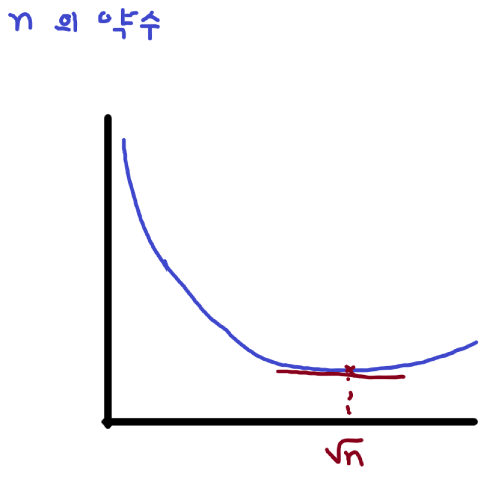
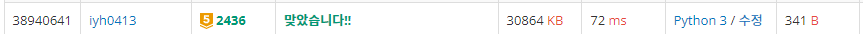

# [Baekjoon] 2436. 공약수 [G5]

### 📚 문제

https://www.acmicpc.net/problem/2436

---

최대 공약수와 최소 공배수가 주어졌을 때, 두 개의 자연수를 구하는 문제이다.

최대 공약수 N, 최소 공배수 M, 두 개의 자연수는 A , B(A<=B) 라고 하자.

최대 공약수와 최소 공배수의 관계를 생각한다.

> 1. 최대 공약수와 최소 공배수의 곱은 두 자연수의 곱이다
>
>    A * B = N * M
>
> 2. 두 자연수는 최대 공약수의 배수이다.
>
>    A = N * a, 
>
>    B = N * b

N을 알고 있으니 a, b만 구하면 된다.

위 두 식을 조합해보면 `a * b = M // N` 이다.

>1. 약수 구하기
>
>   `M // N` 값의 약수를 구한다. 약수를 구해 두 수를 튜플로 리스트에 담는다.
>
>2. 서로소 구하기
>
>   그리고 그 약수들 중 서로소를 찾아야 하니 **유클리드 호제법**을 사용해 최소 공배수가 1인 두 수만 새로운 리스트에 담는다.
>
>3. 최소값 구하기
>
>   서로소 리스트를 순회하며 합을 구해 최소값을 찾는다.

위 방법으로 작성해서 제출해보니!

### 🔍 1차 제출 결과 

---

96% 달성할 쯤 **런타임 에러**가 발생한다. 두 수가 같을 때 처리를 안해줘서 그런 것 같아 조건문을 추가한다.

두 개가 같은 경우를 처리하기 위해 같을 때 두 수를 그대로 출력하게 한다.

### 📒 코드

```python
N, M = map(int, input().split())            # N 최대공약수, M 최소공배수

if N == M:                                  # N, M이 같을 때 입력 그대로 출력한다.
    print(N, N)
else:
    constant = M//N                         # 최대 공배수에서 최소 공배수를 나눈다.
    div_num = constant                      # 약수 구하면서 값이 바뀌니 다른 변수에 저장
    div_lst = []        # 약수의 짝을 튜플로 담을 리스트
    for i in range(1, div_num):
        if i * i > div_num:                 # 제곱근 이상의 약수는 구할 필요 없다.
            break
        
        if div_num % i == 0:                # 약수 구하기, 약수의 짝을 항상 생각한다.
            if i * i == div_num:            # 제곱수일 때 처리해준다.
                div_lst.append((i,i))       
            else: div_lst.append((i,constant//i))   # i에 더 작은 값이 들어간다.

    each_other_lst = []      # 서로소 약수 짝을 튜플로 담을 리스트
    for i in range(len(div_lst)):           # 유클리드 호제법으로 서로소인지 구하기
        a, b = div_lst[i]                   # 약수를 담은 리스트에서 tuple 하나씩 가져온다.
        while a % b != 0:                   # 두 수의 최대 공약수를 구해준다.
            a, b = b, a % b                 # a가 b로 나누어 떨어지는 순간 출력되는 b가 최대 공약수이다.
        if b == 1:                          # 최대 공약수가 1일 때가 서로소이다.
            each_other_lst.append(div_lst[i])

    a = each_other_lst[0][0]
    b = each_other_lst[0][1]
    min = a + b                             # a + b값을 서로소 리스트의index 0 값으로 초기화

    for x, y in each_other_lst:
        if min > x + y:                     # 합이 더 작을 때 a, b에 담아준다.
            min = x + y
            a = x
            b = y

    print(a*N, b*N)     # A, B는 a*N, b*N이니 다시 곱해서 출력한다.
```

### 🔍 결과


**약수 구할 때 제곱근 활용 및 제곱 수**일 때 조심하는 것과 **유클리드 호제법**으로 **최소 공배수를 구해 서로소를 찾는 방법**이 필요하다.

두 수가 같을 때 처리해주지 않아 런타임 에러가 발생했으니 좀 더 꼼꼼히 문제를 확인하자!

## 좀 더 나은 해답 발견!

**약수의 짝의 합이 제곱근에 가까워질수록 작아진다**는 것을 활용한다.

>n의 약수 중 하나를 x라고 하자.
>
>그러면 다른 약수는 x/n이다.
>
>우리는 x + x/n의 최솟값을 구한다.
>
>x+x/n을 미분하면 1-n/(x^2) 이다.
>
>따라서 x가 [0,x의 제곱근] 구간에서는 항상 감소한다.
>
>그러므로 제곱근에 가까워진 x의 짝의 합이 가장 작다.



그러면 a, b를 뽑아 약수인지 확인하고 서로소인지까지 확인한 후 값을 고르면 된다. 어차피 제곱근이하가 될 때까지 a, b를 구한 후 for 문이 끝나기 때문에 리스트에 넣어줄 필요가 없다. 두 수가 같을 때도 리스트에 담지 않으니 신경쓰지 않아도 된다.

### 📒 코드

```python
N, M = map(int, input().split())
constant = M//N
div_num = constant
for i in range(1, div_num+1):
    if i * i > div_num:
        break
    if div_num % i == 0:
        x = i
        y = constant//i
        while x % y != 0:
            x, y = y, x % y
        if y == 1:
            a = i
            b = constant//i
print(a*N, b*N)
```

### 🔍 결과



x+n/x 같이 역수의 합은 n(양수)의 제곱근에서 가장 최솟값을 갖는다는 걸 기억하자!