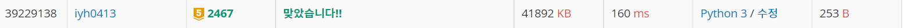

# [Baekjoon] 2467. 용액 [G5]

## 문제📚

https://www.acmicpc.net/problem/2467

---

투포인터 문제이다. 수를 정렬해서 투포인터를 사용해야하는데 정렬되어있으니 아주 편하다.

두 수의 합의 절댓값의 최솟값을 구해야하니 두 수를 합해 0보다 큰 수인 e를 -1, 0보다 작으면 작은 수인 s를 +1 한다.

5개 숫자인 예제로 설명해보면,

s(start)와 e(end)는 각각 시작과 끝에서 시작한다. s와 e가 이동할 때마다 그 때의 절댓값을 비교해 가장 작은 숫자들을 담을 것이다.

|  -9  |  -4  |  2   |  3   |  5   |
| :--: | :--: | :--: | :--: | :--: |
|  s   |      |      |      |  e   |

s + e가 -4이다. 현재 -9, 5만 봤으니 이 때의 절대값이 현재 최소값으로 두 수를 저장한다. 그리고 -4로 음수이니 s를 오른쪽으로 움직인다. e가 움직이는 어떤 경우여도 값은 더욱 작아지니 s를 한 칸 움직이는 것이다. 

|  -9  |  -4  |  2   |  3   |  5   |
| :--: | :--: | :--: | :--: | :--: |
|      |  s   |      |      |  e   |

s와 e의 합이 1이다. 이 때의 합이 이전에 저장된 두 수의 합의 절댓값보다 크니 바꾸어 준다. s + e가 1이므로 e를 왼쪽으로 옮긴다.

|  -9  |  -4  |  2   |  3   |  5   |
| :--: | :--: | :--: | :--: | :--: |
|      |  s   |      |  e   |      |

s와 e의 합이 -1이다. 이 때의 합이 이전에 저장된 두 수의 합의 절댓값과 같으니 바꾸던지 안 바꾸던지 상관없다. 문제에서도 아무것이나 출력하라고 명시되어 있다. 그리고 s + e가 음수이므로 s를 오른쪽으로 옮긴다.

|  -9  |  -4  |  2   |  3   |  5   |
| :--: | :--: | :--: | :--: | :--: |
|      |  s   |  e   |      |      |

s와 e의 합이 -2이다. 두 수의 합의 절댓값이 저장되어 있던 두 수의 합의 절댓값보다 크니 안 바꾼다. 두 수의 합이 음수이니 s가 오른쪽으로 옮겨야 한다. s와 e가 서로 겹치는 경우 반복문을 종료시킨다.

## 📒 코드

```python
N = int(input())
arr = list(map(int, input().split()))

s = 0
e = N-1

x, y = arr[s], arr[e]
while e - s > 0:
    if abs(arr[s] + arr[e]) < abs(x + y):
        x, y = arr[s], arr[e]
    if arr[s] + arr[e] > 0:
        e -= 1
    else: s += 1
print(x, y)
```

## 🔍 결과

