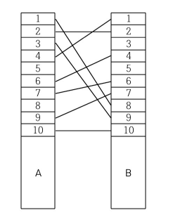
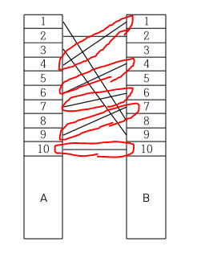
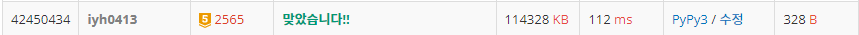

# [Baekjoon] 2565. 전깃줄 [G5]

## 📚 문제

https://www.acmicpc.net/problem/2565

---

## 📖 풀이

접근법을 찾기 어려웠는데 **가장 긴 증가하는 부분수열(LIS)**의 개수를 구하는 문제이다.

왜 그런지 예제를 보며 확인해본다.



다음과 같이 A와 B를 연결하는 전깃줄이 주어진다.

가장 많이 남아있게 하면 아래와 같다.



남아 있는 전깃줄을 A가 작은 것부터 확인하면 B에도 작은 순으로 적혀있다.

따라서 입력받은 전깃줄을 A로 오름차순 정렬시켜 B의 값을 적어준다.

위와 같이 입력받으면 A가 작은 순으로 배열에 담는다.

> `[8, 2, 9, 1, 4, 6, 7, 10]`

이 배열에서 가장 긴 증가하는 부분수열을 찾으면 된다.

그러면 `1 4 6 7 10`이다. 따라서 전체 배열의 길이에서 LIS의 길이를 뺀 나머지를 제거하면 되니까, 제거할 개수는 `전체 배열의 길이 - LIS의 길이`이다.


LIS의 길이를 구하는 건 DP를 활용한다.

개수가 500개까지이니 굳이 이진탐색으로 하지 않고 완전탐색을 활용해도 상관 없다. `O(n^2)`이어도 시간 제한에 걸리지 않는다.


위 예제에서 LIS를 구하는 과정을 하나씩 적어본다.

배열 `[8, 2, 9, 1, 4, 6, 7, 10]`

1. 먼저 DP에 1을 다 담아준다. 왜냐면 숫자가 하나만 있는 경우도 길이가 1이기 때문이다.
2. 배열을 순회한다.
3. 꺼냈으면 왼쪽에 있는 값들 중 자신보다 작은 값들을 모두 확인한다. 작은 값들 중, DP 값이 가장 큰 값을 찾아 1을 더해 DP 값에 넣어준다.


## 📒 코드

```python
n = int(input())
arr = [list(map(int, input().split())) for _ in range(n)]
arr.sort()      # A의 위치로 오름차순 정렬
for i in range(n):      # B의 위치만 담아준다.
    arr[i] = arr[i][1]
dp = [1 for _ in range(n)]      # LIS 구하기 위한 DP 배열
result = 0              # LIS 길이를 담을 변수
for i in range(n):      # LIS 구하기
    for j in range(i):
        if arr[j] < arr[i]:     # 현재 값보다 작은 값을 찾는다.
            dp[i] = max(dp[i], dp[j] + 1)   # 작은 값 중 현재 길이가 가장 긴 값 + 1과 비교한다.
    result = max(result, dp[i])     # 최댓값 갱신

print(n - result)       # n - LIS
```

## 🔍 결과

