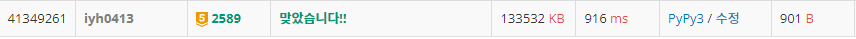

# [Baekjoon] 2589. 보물섬 [G5]

## 📚 문제

https://www.acmicpc.net/problem/2589

---

## 📖 풀이

**최단 거리**를 구하는 문제로 **BFS탐색**을 활용한다.

모든 육지의 위치에서 BFS 탐색을 하며,  BFS로 이동 거리가 가장 먼 거리를 출력한다.

size로 같은 거리의 정점들을 순회하며 다음 거리의 정점들과 구별을 해준다.

순회가 끝나면 거리를 1씩 더한다. 그리고 다음 거리의 정점들을 다시 순회한다.

## 📒 코드

```python
from collections import deque


def in_range(x, y):     # 범위 안에 속하는지 확인할 함수
    return 0 <= x < n and 0 <= y < m


def bfs(x, y):
    visited = [[0] * m for _ in range(n)]
    que = deque()
    que.append((x, y))
    visited[x][y] = 1
    d = -1
    while que:
        size = len(que)     # 같은 이동거리의 정점들을 묶을 size
        for _ in range(size):       # 같은 이동 거리의 정점들을 순회
            x, y = que.popleft()

            for nxt in range(4):    # 네 방향 탐색
                nx = x + dx[nxt]
                ny = y + dy[nxt]
                # 범위를 초과하거나, 방문했거나, 바다인 경우는 continue
                if not in_range(nx, ny) or visited[nx][ny] or arr[nx][ny] == 'W':
                    continue
                visited[nx][ny] = 1
                que.append((nx, ny))
        d += 1  # 이동 거리
    return d


dx = [0, 1, 0, -1]  # 우 하 좌 상
dy = [1, 0, -1, 0]
n, m = map(int, input().split())
arr = [input() for _ in range(n)]

max_d = 0       # 출력할 최대 거리 초기화
for i in range(n):                  # 모든 육지의 위치에서 완전 탐색
    for j in range(m):
        if arr[i][j] == 'W':        # 바다인 경우 continue
            continue
        max_d = max(max_d, bfs(i, j))   # 최대 거리를 구한다.

print(max_d)
```

## 🔍 결과

