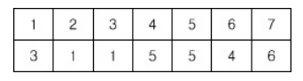
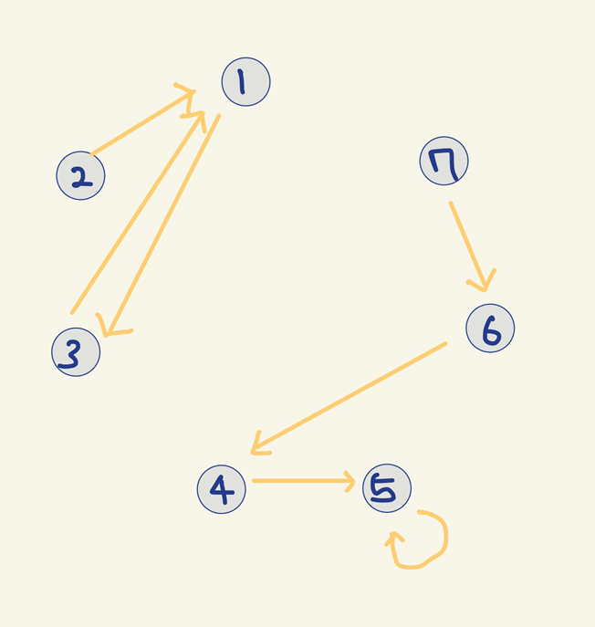
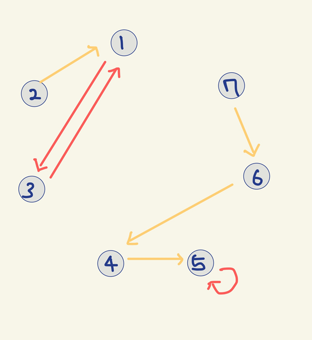
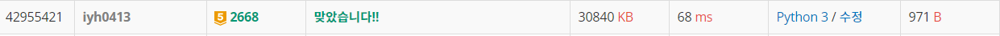

# [Baekjoon] 2668. 숫자고르기 [G5]

## 📚 문제 : [숫자고르기](https://www.acmicpc.net/problem/2668)

---

## 📖 풀이

**싸이클**을 찾는 문제이다. 싸이클을 어떻게 쉽게 찾을까 고민을 많이 했던 문제다.



표 위의 값을 아래 값으로 방향 그래프로 연결한다. 

**dfs**로 연결관계를 파악하며 현재 위치로 되돌아오는 경우 싸이클을 형성하는 경우이다.

연결된 걸 visited에 넣으면서 확인한다. 나왔던 숫자가 나왔을 때 시작 값이면 싸이클 형성하는 경우고, 시작 값이 아닌 수가 또 나오면 싸이클을 형성하지 않는 경우이다.

예제로 그림으로 그려보며 파악해보자!



위의 노드에서 아래 노드로 화살표를 연결한다.



순환되는 경우를 빨간색으로 표현해보았다.

다음과 같이 순환되는 경우의 값을 담으면 답이다.

숫자 1부터 7까지 확인한다.

1. 1 => 3 => 1 이니 순환된다. 

   result = [1]

2. 2 => 1 => 3 => 1 자신의 값이 아닌 다른 값이 또 나왔다. 그러면 X

3. 3 => 1 => 3 이니 순환된다.

   result = [1, 3]

4. 4 => 5 => 5 자신의 값이 아닌 다른 값이 나오니 X

5. 5 => 5 순환

   result = [1, 3, 5]

6. 6 => 4 => 5 => 5 순환 X
7. 7 => 6 => 4 => 5 => 5 순환 X

따라서 답은 1, 3, 5이다.

## 📒 코드

```python
def dfs(x):            # 순환되는지 확인
    global s
    visited.append(x)
    if graph[x] not in visited:     # 새로운 값이 나오면 연결된 다음 그래프 탐색
        dfs(graph[x])
    elif graph[x] == s and graph[x] in visited:  # 시작점이 또 나왔으면 종료
        result.append(s)        # 시작점을 result 배열에 담는다.


n = int(input())
graph = [0 for _ in range(n + 1)]     # 위에서 아래 방향으로 하나씩 연결

for i in range(1, n + 1):       # 첫째줄에서 둘째줄로 연결 관계 표시
    graph[i] = int(input())

result = []         # 싸이클을 이루는 시작점을 담는다.
for s in range(1, n + 1):
    visited = []        # 부모 노드를 탐색하며 값을 담아줄 visited 배열
    dfs(s)
        
print(len(result))      # result의 길이
for i in sorted(result):        # result를 정렬 후 순서대로 출력
    print(i)
```

## 🔍 결과


