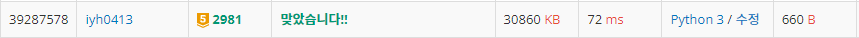

# [Baekjoon] 2981. 검문 [G5]

## 📚 문제

https://www.acmicpc.net/problem/2981

---

>a % M = k
>
>b % M = k
>
>c % M = k

나머지가 같은 경우는 각 수를 서로 빼면 된다.

> a % M - b % M = 0
>
> a % M - c % M = 0

그럼 주어진 입력을 순서대로 정렬하고 가장 작은 수로 빼주면 다음과 같다.

> a < b < c < d
>
> b % M - a % M = (b-a) % M = 0
>
> c % M - a % M = (c-a) % M = 0
>
> d % M - a % M = (d-a) % M = 0

이렇게 빼준 b-a, c-a, d-a의 공약수를 구하면 M을 구할 수 있다.

최대공약수를 먼저 구한다.

앞에서 두 개의 최대 공약수를 구한 뒤 나온 최대 공약수 값과 뒤의 값의 최대 공약수를 구하는 작업을 반복한다.

구해진 최대 공약수의 약수를 구해 공약수들을 구한다.

공약수를 정렬 후 1을 빼고 출력한다.

## 📒 코드

```python
def gcd(big, small):    # 최대 공약수
    while big % small:
        big, small = small, big % small
    return small

N = int(input())
arr = [int(input()) for _ in range(N)]
arr.sort()                          # 수를 정렬
for i in range(1, N):               # 젤 작은 수로 나머지 수를 빼서 arr에 담는다.
    arr[i] = arr[i] - arr[0]
del arr[0]                          # 젤 작은 수를 제거, 서로 뺀 차이만 남긴다.
                                # 위 배열에 있는 수들의 공약수를 구하면 된다.
num = arr[0]                    # 최대 공약수를 담을 변수, 첫 번째 수를 담는다.
for i in range(1, len(arr)):    # 최대 공약수와 수들을 하나씩 다시 최대 공약수를 구해준다.
    num = gcd(num, arr[i])

result = []                     # 약수를 담을 배열
for i in range(1, num + 1):     # 최대 공약수의 약수들을 구해 공약수들을 찾아준다.
    if i * i >= num:
        if i * i == num:
            result += [i]
        break
    if num % i == 0:
        result += [i, num // i]
result.sort()                   # 최대 공약수들을 다시 정렬

del result[0]                   # 1은 뺀다.
print(*result)
```

## 🔍 결과

