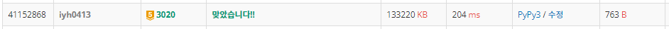

# [Baekjoon] 3020. 개똥벌레 [G5]

## 📚 문제

https://www.acmicpc.net/problem/3020

---

## 📖 풀이

종유석과 석순을 카운팅 배열에 담아주는 방법을 생각해본다.

종유석이 3이면 배열에 1 2 3에 + 1 해준다.

다음과 같이 순간마다 모든 값을 넣어주면 `O(n * m)`에서 n이 20만, m이 50만이니 무조건 시간초과가 발생한다.

종유석과 석순은  무조건 0부터 시작한다. 따라서 **누적합**을 활용한다.


예제를 보면

- Input

  ```
  6 7
  1
  5
  3
  3
  5
  1
  ```


종유석과 석순을 각각 배열을 따로 만든다.

석순을 담아준다. 길이는 현재 7로 주어져있다.

석순은 홀수 순서대로 들어온다.

|      | 1    | 2    | 3    | 4    | 5    | 6    | 7    |
| ---- | ---- | ---- | ---- | ---- | ---- | ---- | ---- |
| 1    | 1    | 0    | 0    | 0    | 0    | 0    | 0    |
| 3    | 1    | 0    | 1    | 0    | 0    | 0    | 0    |
| 5    | 1    | 0    | 1    | 0    | 1    | 0    | 0    |


종유석을 담아준다.

종유석은 역순으로 담아준다.

|      | 1    | 2    | 3    | 4    | 5    | 6    | 7    |
| ---- | ---- | ---- | ---- | ---- | ---- | ---- | ---- |
| 5    | 0    | 0    | 1    | 0    | 0    | 0    | 0    |
| 3    | 0    | 0    | 1    | 0    | 1    | 0    | 0    |
| 1    | 0    | 0    | 1    | 0    | 1    | 0    | 1    |


석순은 뒤에서부터 누적합을 한다. 왜냐하면 0부터 누적되는 값이기 때문에 뒤부터 누적해서 나타내면 된다.

| 1    | 2    | 3    | 4    | 5    | 6    | 7    |
| ---- | ---- | ---- | ---- | ---- | ---- | ---- |
| 3    | 2    | 2    | 1    | 1    | 0    | 0    |


종유석은 앞에서부터 누적합을 한다.

| 1    | 2    | 3    | 4    | 5    | 6    | 7    |
| ---- | ---- | ---- | ---- | ---- | ---- | ---- |
| 0    | 0    | 1    | 1    | 2    | 2    | 3    |


석순의 누적합과 종유석의 누적합의 배열을 더해 가장 작은 값과 그 때의 개수를 출력한다.

누적합 배열을 만들기위해 앞 뒤로 padding을 넣어주면 편하다!


## 📒 코드

```python
import sys
input = sys.stdin.readline

n, m = map(int, input().split())    # n:동굴의 길이, m:동굴의 높이
arr_up = [0 for _ in range(m + 2)]  # 석순, 앞뒤로 padding을 넣어준다.(누적합을 위해)
arr_down = [0 for _ in range(m + 2)]  # 종유석
for i in range(n):
    height = int(input())
    if i % 2:   # 종유석, 위에서 내려온다.
        arr_up[height] += 1
    else:   # 석순, 아래서 올라온다.
        arr_down[-height-1] += 1

for i in range(1, m + 1):   # 역방향으로 누적합
    arr_up[m + 1 - i] += arr_up[m + 2 - i]
    arr_down[i] += arr_down[i - 1]

small = n
cnt = 0
for i in range(1, m + 1):
    v = arr_up[i] + arr_down[i]
    if v < small:
        small = v
        cnt = 1
    elif v == small:
        cnt += 1

print(small, cnt)
```

## 🔍 결과

