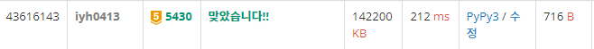

# [Baekjoon] 5430. AC [G5]

## 📚 문제 : [AC](https://www.acmicpc.net/problem/5430)

## 📖 풀이

구현문제이다.

입력된 문자열이 지저분하니 슬라이싱과 split을 활용해 배열로 바꿔준다.

회전을 홀수번 한 경우는 앞에서 지우고 짝수번 한 경우는 뒤에서 지운다.

따라서 입력되는 함수를 순회하면서 회전을 홀수번, 짝수번을 `비트 연산자(^)`을 활용해 스위칭한다.

제거할 때는 2가지로 나눈다.

- 짝수번 회전한 경우 : 앞에서부터 지운다.
- 홀수번 회전한 경우 : 뒤에서부터 지운다.

직접 지우면서가기보다는 맨 앞 인덱스(`s`)와 뒤 인덱스(`e`)를 선언한다.

앞에서 지우는 경우는 s를 0부터 1씩 더하고, 뒤에서 지우는 경우는 e를 n부터 1씩 뺀다.

함수 적용이 끝난 후 문자열을 바꿔 출력한다.

1. s가 e보다 크면 문자열보다 더 제거된 경우이므로 error를 출력한다.
2. 회전을 짝수번 한 경우는 문자열을 위에서 구한 인덱스로 슬라이싱한 후(`[s:e]`) 출력한다.
3. 회전을 홀수번 한 경우는 2번 처럼 슬라이싱한 후 전체적으로 뒤집어준다.(`[::-1]`)

join으로 ,를 붙여주고, 앞 뒤로 `[]`를 붙여서 출력한다.

## 📒 코드

```python
t = int(input())
for _ in range(t):
    p = input()
    n = int(input())
    arr = input()[1:-1].split(',')      # 배열로 바꾼다.
    
    s = 0   # 시작 인덱스
    e = n   # 마지막 인덱스
    r = 0   # 회전(홀짝 판별)
    for x in p:
        if x == 'R':
            r ^= 1
        else:
            if r:   # 홀수번 회전 뒤를 지운다.
                e -= 1
            else:       # 짝수번 회전 앞을 지운다.
                s += 1
    if s > e:      # 숫자 개수보다 더 지운 경우
        print('error')
    elif r:
        print('[' + ','.join(arr[s:e][::-1]) + ']')     # 원하는 출력형태로 변경
    else:
        print('[' + ','.join(arr[s:e]) + ']')
```

## 🔍 결과

