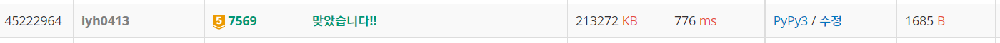

# [Baekjoon] 7569. 토마토 [G5]

## 📚 문제 : [토마토](https://www.acmicpc.net/problem/7569)

## 📖 풀이

**BFS** 문제이다. 저번 토마토는 2차원이었는데 이번엔 3차원이다.

익은 토마토들을 다 큐에 담는다.

익은 토마토를 6방향(3차원)으로 탐색하며 익지 않은 토마토만 확인한다. 주변 토마토를 익은 토마토로 바꾼다. 

depth를 체크한다. bfs의 depth가 day이다. 처음에 있던 토마토들을 순회하는 과정이 있으므로 -1부터 day를 카운트한다.

더 이상 큐에 토마토가 없다면 남은 토마토들 중 익지 않은 토마토들이 있는지 확인한다.

익지 않은 토마토가 있으면 -1을 출력하고, 없다면 day를 출력한다.

## 📒 코드

```python
from collections import deque


def in_range(z, x, y):              # 범위를 만족하는지 확인해주는 함수
    return 0 <= x < n and 0 <= y < m and 0 <= z < h


def riping():                       # 토마토가 다 익었을 떄 날짜를 리턴하는 함수
    que = deque()
    for i in range(h):
        for j in range(n):
            for k in range(m):
                if arr[i][j][k] == 1:       # 익은 토마토들을 큐에 저장
                    que.append([i, j, k])
                    # visited[i][j][k] = 1
    
    day = -1     # 날짜, 반복문을 한 번 돌 때 이미 익은 토마토들을 순회하므로 그 때 0이 되게 -1로 시작한다.
    while que:
        sz = len(que)
        for _ in range(sz):
            z, x, y = que.popleft()
            for nxt in range(6):
                nz = z + dz[nxt]
                nx = x + dx[nxt]
                ny = y + dy[nxt]
                if in_range(nz, nx, ny) and arr[nz][nx][ny] == 0:
                    arr[nz][nx][ny] = 1
                    que.append([nz, nx, ny])
        day += 1

    # 익지 않은 토마토가 있는지 확인
    for i in range(h):
        for j in range(n):
            for k in range(m):
                if arr[i][j][k] == 0:
                    return -1       # 익힐 수 없는 토마토가 있으면 -1 리턴
    return day

m, n, h = map(int, input().split())
arr = [[list(map(int, input().split())) for _ in range(n)] for _ in range(h)]   # -1: 없을 떄, 0: 익지 않았을 때, 1: 익었을 때
dx, dy, dz = [0, 1, 0, -1, 0, 0], [1, 0, -1, 0, 0, 0], [0, 0, 0, 0, 1, -1]      # 우, 하, 좌, 상, 앞, 뒤

print(riping())     # 날짜 출력
```

## 🔍 결과



