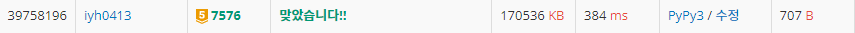

# [Baekjoon] 7576. 토마토 [G5]

## 📚 문제

https://www.acmicpc.net/problem/7576

---

토마토가 모두 익을 때까지의 최소 날짜 출력하는 문제이다.

토마토가 있는 1을 찾아 주변의 영역을 1씩 더해준다.

처음에는 하루가 지날 때마다 배열 전체를 읽으며 익은 영역을 넓혀주는 방법으로 해결하려고 했다. 그렇지만 이렇게 작성하니 **시간초과**가 발생한다.

따라서 토마토가 있는 1을 큐에 담아 순차적으로 읽으며 주변영역을 2,3,4... 영역을 넓혀주는 **BFS 탐색**으로 해결했다.

**deque 자료구조**를 활용한다.

>먼저 입력받은 2차원 배열을 한 번 돌면서 1이 있는 (i, j) 위치를 모두 큐에 담는다.
>
>큐를 돌면서 1 주변에 0이 있는 영역을 2로 바꿔주고, 다시 큐에 담는다. 이걸 반복한다. (큐에 n 값이 들어오면 주변의 0을 n+1로 바꾼다.)
>
>큐에 숫자가 작은 순서대로 들어와 영역을 넓히니 만나는 경우는 따로 생각해주지 않아도 된다.
>
>최종적으로 다 돌고 배열을 2번 돌며 0이 아직 남아있으면 -1을 출력하고 종료한다.
>
>0이 없으면 큐에 남아있는 걸 없애며 저장해준 날짜를 출력한다.
>
>하루지나면 2, 이틀지나면 3 이런 식으로 최고값이 들어가니 값을 바꿔줄 때마다 최고값 -1로 출력시킬 날짜를 갱신해준다.

## 📒 코드

```python
from collections import deque
import sys
input = sys.stdin.readline

m, n = map(int, input().split())
arr = [list(map(int, input().split())) for _ in range(n)]
dy = [0, 1, 0, -1]  # 우 하 좌 상
dx = [1, 0, -1, 0]
queue = deque()
day = 0

for i in range(n):  # 큐에 1을 담는다.
    for j in range(m):
        if arr[i][j] == 1:
            queue.append((i, j))

while queue:
    y, x = queue.popleft()
    for i in range(4):  # 값의 네 방향으로 탐색
        ny = y + dy[i]
        nx = x + dx[i]
        if 0 <= ny < n and 0 <= nx < m and arr[ny][nx] == 0:    # 범위를 넘지않으며 0이면 값을 바꾼다.
            arr[ny][nx] = arr[y][x] + 1     # 현재 가운데 값에 1을 더해준다. 익으면 날짜가 +1
            if arr[ny][nx] - 1 > day:       # 0일일 때 값이 1, 1일일 때 값이 2이니 1을 빼준 값을 넣어준다.
                day = arr[ny][nx] - 1
            queue.append((ny, nx))          # 영역을 확장하면 그 부분도 다시 큐에 담는다.

for ar in arr:      # 2차원 배열을 읽으며 0이 있는지 확인한다.
    if 0 in ar:
        day = -1    # 0이 있으면 아직 익지 못한 토마토가 있으니 -1을 출력한다.

print(day)
```

## 🔍 결과


