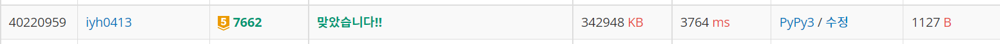

# [Baekjoon] 7662. 이중 우선순위 큐 [G5]

## 📚 문제

https://www.acmicpc.net/problem/7662

---

이중 우선순위 큐는 **힙 자료구조**를 활용한다.

**최대 힙**과 **최소 힙** 둘 다 만들어서 사용한다.

최대값을 제거할 땐 최대 힙에서 pop하고 최소값을 제거할 땐 최소 힙에서 pop해주는데

제거했던 수를 또 제거하면 안된다. 따라서 각 수를 집어넣을 때 tuple로 **id**값을 만들어 넣어준다.

첫 번째 넣어줄 땐 0 그다음은 1, 2, 3 ...으로 넣어줘 pop했을 때 visited 카운팅 배열로 선언해 id가 나왔으니, 1로 바꾸어준다.

나왔던 값을 또 pop한 경우에는 카운팅 배열에 id 인덱스의 값이 1이라고 표시되어 있으므로, 카운팅 배열에 id 인덱스의 값이 0이 나올 때까지 pop해야 한다.

연산을 다 해준 후, 마지막에 최댓값, 최솟값을 출력할 때도 pop해서 나온 값을 출력한다.

값이 하나만 존재할 땐 그 값이 최대이자 최소이므로 2번 출력하도록 코드를 짠다.

## 📒 코드

```python
import heapq
import sys
input = sys.stdin.readline


def insert(num, id):   # 값을 넣어준다. id값과 튜플로 넣어 서로 나왔는지 확인할 수 있게 해준다.
    heapq.heappush(min_heap, (num, id))
    heapq.heappush(max_heap, (-num, id))

def pop(num):
    if num == 1:    # 최대값을 꺼내는 경우
        while max_heap:     # 힙에 값이 있을 때
            pop_num = heapq.heappop(max_heap)
            if not visited[pop_num[1]]:     # 꺼내지 않았던 수이면 중단시킨다.
                visited[pop_num[1]] = 1     # 방문 표시
                return - pop_num[0]     # 값을 넣을 때 -를 붙였으니 제거 후 꺼낸다.
    else:          # 최소값을 꺼내는 경우
        while min_heap:
            pop_num = heapq.heappop(min_heap)
            if not visited[pop_num[1]]:
                visited[pop_num[1]] = 1
                return pop_num[0]

for i in range(int(input().rstrip())):
    n = int(input().rstrip())
    visited = [0 for _ in range(n)]     # id값이 pop했는지 확인할 카운팅 배열
    min_heap = []
    max_heap = []
    id = 0         # 각 최대 최소에서 서로 나왔는지 확인하기 위한 id
    for i in range(n):
        cal, num = input().split()
        if cal == 'I':
            insert(int(num), id)
        else:
            pop(int(num))
        id += 1
    
    result = []
    result.append(pop(1))
    if result[0]:       # 값이 존재하는 경우
        result.append(pop(-1))
        if result[1]:       # 값이 2개 이상 존재하는 경우
            print(*result)
        else:           # 값이 하나만 존재하는 경우, 최대 최소가 같으므로 2번 출력
            print(result[0], result[0])
    else:               # 값이 없는 경우
        print('EMPTY')
```

## 🔍 결과

