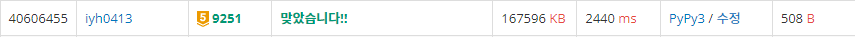

# [Baekjoon] 9251. LCS [G5]

## 📚 문제

https://www.acmicpc.net/problem/9251

---

LCS(Longest Common Subsequence, 최장 공통 부분 수열)문제는 두 수열이 주어졌을 때, 모두의 부분 수열이 되는 수열 중 가장 긴 것을 찾는 문제이다.

문자열은 알파벳 대문자로만 이루어져 있다.


- Input

```
ACAYKP
CAPCAK
```

첫 번째 문자열을 순회하며 알파벳을 key로 인덱스 리스트를 값으로 하는 딕셔너리를 만든다.

> ACAYKP
>
> `{A:[0, 2] C:[1] Y:[3] K:[4] P:[5]}`


두 번째 문자열을 순서대로 순회하며 하나씩 딕셔너리에서 값을 확인한다. 나온 숫자들 중 dp에 나온 index가 더 적은 것들 중 최댓값 + 1과 현재 최댓값과 비교해 바꾸어준다.


먼저 C가 들어오면 첫 번째 문자열에서 C는 첫 번째 인덱스 이므로 첫번째 인덱스에 1을 더해준다.

| index    | 0    | 1    | 2    | 3    | 4    | 5    |
| -------- | ---- | ---- | ---- | ---- | ---- | ---- |
| C (1)    |      | 1    |      |      |      |      |
| A (0, 2) |      |      |      |      |      |      |
| P (5)    |      |      |      |      |      |      |
| C (1)    |      |      |      |      |      |      |
| A (0, 2) |      |      |      |      |      |      |
| K (4)    |      |      |      |      |      |      |


A는 0과 2인데 0은 왼쪽에 없으므로 1이고, 2는 왼쪽에 1이 있으니 1 + 1 = 2이다.

| index    | 0    | 1    | 2    | 3    | 4    | 5    |
| -------- | ---- | ---- | ---- | ---- | ---- | ---- |
| C (1)    | 0    | 1    |      |      |      |      |
| A (0, 2) | 1    | 1    | 2    |      |      |      |
| P (5)    |      |      |      |      |      |      |
| C (1)    |      |      |      |      |      |      |
| A (0, 2) |      |      |      |      |      |      |
| K (4)    |      |      |      |      |      |      |


P는 5이니 왼쪽에 가장 큰 값인 2에다가 1을 더한다.

| index    | 0    | 1    | 2    | 3    | 4    | 5    |
| -------- | ---- | ---- | ---- | ---- | ---- | ---- |
| C (1)    | 0    | 1    |      |      |      |      |
| A (0, 2) | 1    | 1    | 2    |      |      |      |
| P (5)    | 1    | 1    | 2    |      |      | 3    |
| C (1)    |      |      |      |      |      |      |
| A (0, 2) |      |      |      |      |      |      |
| K (4)    |      |      |      |      |      |      |


C는 1이니 왼쪽의 1에 1을 더한다.

| index    | 0    | 1    | 2    | 3    | 4    | 5    |
| -------- | ---- | ---- | ---- | ---- | ---- | ---- |
| C (1)    | 0    | 1    |      |      |      |      |
| A (0, 2) | 1    | 1    | 2    |      |      |      |
| P (5)    | 1    | 1    | 2    |      |      | 3    |
| C (1)    | 1    | 2    | 2    |      |      | 3    |
| A (0, 2) |      |      |      |      |      |      |
| K (4)    |      |      |      |      |      |      |


A는 0, 2이니 0은 그대로이고, 2는 왼쪽에서 가장 큰 값이 2에 1을 더한다.

| index    | 0    | 1    | 2    | 3    | 4    | 5    |
| -------- | ---- | ---- | ---- | ---- | ---- | ---- |
| C (1)    | 0    | 1    |      |      |      |      |
| A (0, 2) | 1    | 1    | 2    |      |      |      |
| P (5)    | 1    | 1    | 2    |      |      | 3    |
| C (1)    | 1    | 2    | 2    |      |      | 3    |
| A (0, 2) | 1    | 2    | 3    |      |      | 3    |
| K (4)    |      |      |      |      |      |      |


K는 4이니 왼쪽에 가장 큰 3에다가 1을 더한다.

| index    | 0    | 1    | 2    | 3    | 4    | 5    |
| -------- | ---- | ---- | ---- | ---- | ---- | ---- |
| C (1)    | 0    | 1    |      |      |      |      |
| A (0, 2) | 1    | 1    | 2    |      |      |      |
| P (5)    | 1    | 1    | 2    |      |      | 3    |
| C (1)    | 1    | 2    | 2    |      |      | 3    |
| A (0, 2) | 1    | 2    | 3    |      |      | 3    |
| K (4)    | 1    | 2    | 3    |      | 4    | 3    |


다 끝났으면 DP 값 중 최댓값인 4를 출력한다.

위와 같은 과정을 사용하여 해결한다.

## 📒 코드

```python
arr1 = list(input())    # 첫 번째 문자열
arr2 = list(input())    # 두 번째 문자열

dic = {}                # 딕셔너리에 첫 번째 문자열의 문자는 key에 값에는 인덱스들을 리스트로 넣어준다.
for i in range(len(arr1)):
    if dic.get(arr1[i]):    # 있던 값일 때 추가
        dic[arr1[i]] += [i]
    else:                   # 처음 나왔을 때
        dic[arr1[i]] = [i]

dp = [0 for _ in range(1005)]   # dp 초기화
for s in arr2:      # 두 번째 문자열 순회
    v_arr = dic.get(s)  # 문자의 첫번째 문자열에서의 인덱스들의 집합
    if v_arr:   # 리스트가 있을 때
        dic2 = {}       # 값을 나중에 바꿔주기 위함
        for v in v_arr:
            if v:       # v가 0이 아닐 때
                dic2[v] = max(max(dp[0:v]) + 1, dp[v])  # 왼쪽에 있는 수 중 가장 큰 값 +1과 현 위치의 값 중 비교해 더 큰 값을 선택
            else:       # v가 0일 때
                dic2[0] = 1
        for v in v_arr: # 값을 한꺼번에 바꿔준다.
            dp[v] = dic2[v]

print(max(dp))  # 가장 큰 값 출력
```

## 🔍 결과



시간이 꽤 오래걸린다..