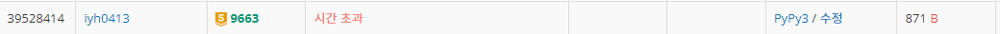
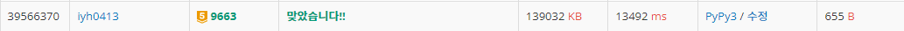

# [Baekjoon] 9663. N-Queen [G5]

## 📚 문제

https://www.acmicpc.net/problem/9663

---

아주 유명한(well known) 백트래킹 문제!

퀸의 개수만큼의 N*N 배열에서 퀸 N개를 배열하는 경우의 수를 찾는 문제이다.

visited를 활용한 가지치기로 경우의 수를 줄여나가며 구하는 백트래킹 문제이다. 재귀를 이용해서 구해보았다.

퀸이 열에만 존재하는지 판단하는 것이 아니라 대각선의 경우의 수도 판단해야하니 2차원 배열로 선언하거나 방문한 퀸의 위치를 리스트에 추가하면서 만들어야한다.

visited를 2차원배열로 선언해서 풀어보았는데 시간초과가 발생한다..

## 📒 1차 코드

```python
N = int(input())   # N개의 퀸
visited = [[0] * N for _ in range(N)]   # N x N 체스판
cnt = 0             # N개를 놓는 경우의 수

def queens(cur):
    global cnt
    if cur == N:    # 퀸을 N개 다 놓으면 cnt 1 증가
        cnt += 1
        return
    for j in range(N):  # 퀸의 위치 선택
        for i in range(1, cur + 1): # 그 전에 나왔는지 확인
            di = cur - i
            if visited[di][j]: # 현재 퀸이 열에 나왔는지 확인
                break
            dj = j - i        
            if dj >= 0 and visited[di][dj]: # 왼쪽 대각선 확인
                break
            dj = j + i
            if dj < N and visited[di][dj]: # 오른쪽 대각선 확인
                break
        else:
            visited[cur][j] = 1
            queens(cur + 1)
            visited[cur][j] = 0
queens(0)
print(cnt)
```

## 🔍 결과 : 시간 초과



---

visited가 순서대로 퀸의 위치를 채워나가는 방식으로 적는다.

첫번째 행부터 퀸을 채워간다. (경우의 수가 N개이다.)

다음 행부터는 이전에 넣었던 퀸의 대각선에도 존재하지 않도록 조건식을 세워준다.

이렇게 해결하니 시간초과가 해결되었다. 최적화할 코드를 구현하는 것이 핵심이다.

## 📒 2차 코드

```python
N = int(input())    # N개의 퀸
visited = []        # queen의 위치
cnt = 0             # N개를 놓는 경우의 수

def queens(cur):
    global cnt
    if cur == N:    # 퀸을 N개 다 놓으면 cnt 1 증가
        cnt += 1
        return
    for i in range(N):          # 퀸의 위치 선택
        if i not in visited:    # 퀸이 원하는 열에 등장하지 않았는지 확인
            for j in range(cur):
                if abs(visited[j] - i) == cur - j:       # 대각선에 등장하지 않아야 함.
                    break
            else:
                visited.append(i)   # 퀸을 위치에 둔다.
                queens(cur + 1)     # 다음 행으로 이동~
                visited.pop()       # 퀸을 위치에서 제거
queens(0)              
print(cnt)
```

## 🔍 결과



