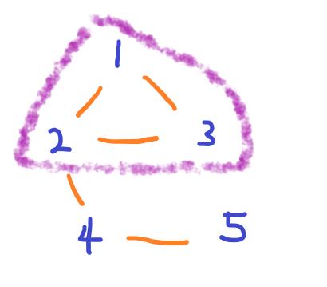
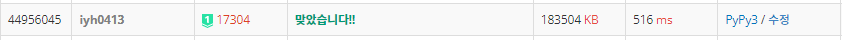

# [Baekjoon] 17304. 변호사들 [P1]

## 📚 문제 : [변호사들](https://www.acmicpc.net/problem/17304)

## 📖 풀이

다 연결시키는데, 양방향으로 연결시키지 않는 경우가 있는지 찾는 문제이다.

트리와 싸이클, 양방향 그래프에 대한 이해가 필요하다.


### 구하는 순서

1. 그래프에 연결 관계 담기
2. 두 노드 사이가 단방향으로만 이어진 경우는 변호 되었음을 표시
3. 두 노드 사이가 양방향으로 이어져있으면서 둘 다 변호 되지 않은 간선들만으로 양방향(무방향) 그래프를 다시 생성
4. 변호되지 않은 양방향 그래프 중 모든 연결 요소가 싸이클이 트리가 아니면서 모두 변호가 되었으면 종료


### 세부적으로 설명

#### 1. 그래프에 연결 관계 담기

- 연결 관계를 2차원 배열에 담는다. 

- 이 때 연결상태를 표시할 때 인접배열 형태로 선언하면 200000 x 200000이라 메모리 초과가 발생한다. 따라서 인접리스트로 생성할 수 있는데 양방향인지 체크할 때 시간복잡도를 O(N)에서 O(1)로 줄이기 위해 set 자료형으로 표현한다.

  > a => b로 연결된 경우, b => a를 확인할 때
  >
  > - 리스트인 경우는 확인하는 데 O(n)이 소요된다.
  > - 세트인 경우는 O(1)이 걸린다.

#### 2. 두 노드 사이가 단방향으로만 이어진 경우는 변호 되었음을 표시

- 변호됐는지는 visited 배열로 표시한다.
- 단방향으로 이루어진 경우는 visited 배열에 변호 되었음을 표시한다.

#### 3. 두 노드 사이가 양방향으로 이어져있으면서 둘 다 변호 되지 않은 간선들만으로 양방향(무방향) 그래프를 다시 생성

- 그리고 연결된 노드들 중 하나라도 이미 변호되었으면 나머지 노드도 변호시키고 양방향 그래프에 넣지 않는다.
- 양방향 간선으로만 이루어진 그래프로 이전의 그래프를 바꿔준다.

#### 4. 변호되지 않은 양방향 그래프 중 모든 연결 요소가 싸이클이 트리가 아니면서 모두 변호가 되었으면 종료



- 위 그림처럼 연결 요소 중 싸이클이 존재해야만 다 변호할 수 있다.

- 싸이클이 존재하지 않는 트리이면, 하나는 무조건 변호할 수 없으므로 종료한다.

- 아무 그래프에도 연결되어있는 노드가 없다면 변호할 수 없으니 종료한다.

  

## 📒 코드

```python
def check():        # 가능한지 체크
    for i in range(1, n + 1):       # 싸이클이 있는지 확인
        if visited[i]:              # 변호했는지 확인
            continue
        if not graph[i] or not dfs(i, 0):     # 변호안했는데 변호할 변호사가 없는 경우
            return 'NO'                     # 그리고 싸이클이 없는 경우
    return 'YES'                    # 위에서 안 걸러졌으면 가능하니 YES 출력


def dfs(node, prv):
    is_cycle = False        # 싸이클 여부
    if visited[node]:       # 변호했었으면 싸이클을 여부 : True
        return True
    visited[node] = 1       # 변호했는지 표시
    for nxt in graph[node]:
        if nxt == prv:      # 이전에 나왔던 곳으로 되돌아 가는 건 X(서로 변호하는 경우)
            continue
        if dfs(nxt, node):  # 연결된 노드들 탐색하여 cycle이 있는지 확인
            is_cycle = True
    return is_cycle


n, m = map(int, input().split())
graph = [set() for _ in range(n + 1)]      # 변호할 수 있는 변호사들의 노드 번호를 담는다.
visited = [0 for _ in range(n + 1)]     # 현재 변호사를 변호 했는지 확인
for i in range(m):
    s, e = map(int, input().split())
    graph[s].add(e)

# 양방향으로 연결된 노드들 확인
two_dir = []                        # 양방향으로 연결된 노드 관계를 담는다.
for i in range(1, n + 1):
    for v in graph[i]:
        if i not in graph[v]:       # 양방향으로 연결되지 않은 경우
            visited[v] = 1
        else:                       # 양방향으로 연결된 경우
            if i > v:               # 양방향 다 담기므로 하나만 담아준다.
                two_dir.append([i, v])

# 양방향으로 연결된 그래프를 인접리스트 형태로 변경
# 양방향 연결된 노드들 중 이미 변호된 노드가 있으면 나머지 노드도 연결한 후 양방향 그래프에는 X
graph_copy = [[] for _ in range(n + 1)]             # 양방향 연결만 확인
for a, b in two_dir:                # 양방향으로 연결된 노드들을 순회
    if visited[a] + visited[b] == 2:        # 둘 다 연결안해도 되는 경우
        continue
    elif visited[a] + visited[b] == 1:  # 하나를 연결할 수 있는 상황이면 연결한다.
        visited[a] = 1
        visited[b] = 1
    else:
        graph_copy[a].append(b)
        graph_copy[b].append(a)
graph = [graph_copy[i][:] for i in range(n + 1)]    # 양방향 연결만 확인(양쪽 다 변호되지 않은)

print(check())
```

## 🔍 결과



