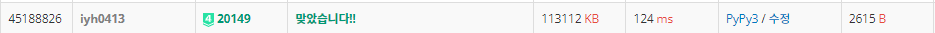

# [Baekjoon] 선분 교차 3 [P4]

## 📚 문제 : [선분 교차 3](https://www.acmicpc.net/problem/20149)

## 📖 풀이

**CCW**를 이용해 교차하는지 구한다.

선분 교차1, 2와 다른 점은 교차점을 구하는 것이다.

이 때 한 점에서 만나는 경우를 CCW로 구하고 그 때만 연립 방정식으로 하나의 교차점을 구하면 된다.

따라서 CCW로 상태를 분기처리할 때 여러 가지로 생각해 나눠야 한다.

1. 두 선분이 교차하는 경우(2, 3, 4에 해당 X)
2. 두 선분이 선분의 끝 점에서 만나는 경우
3. 두 선분이 여러 점에서 겹치는 경우
4. 두 선분이 한 직선 위에 있는데 하나의 점에서 만나는 경우
5. 두 선분이 만나지 않는 경우

먼저 두 선분이 교차하는 경우는 두 선분의 CCW의 곱이 다 0보다 작거나 같으면 된다.

CCW의 곱이 다 0일 때는 양 끝점에서 만나거나 한 선분 위에 놓이는 경우이니 분기처리로 구분해야 한다.

`CCW(p1, p2, p3) == 0 and CCW(p1, p2, p4) == 0`을 만족할 때는 한 직선 위에 놓일 때이다.

이 때 주의할 점은 두 선분이 일직선 위에 놓여있으면서 만나지 않는 경우이다.

- p1 < p2, p3 < p4로 양 끝 점의 순서를 정해주고, p3 <= p2와 p1 <= p4를 만족할 때만 두 선분이 만나는 경우다.
- 따라서 이에 해당되지 않으면 0을 출력한다.

그리고 p3와 p2가 같거나 p1과 p4가 같으면 한 점에서 만나는 경우이니 교차점도 출력해야 한다.


교차점을 구할 땐 연립방정식을 사용해 해결한다.

기울기를 구하고 y절편을 구해 교차점을 출력한다.

이 때 y축과 평행한 직선이 나오면 기울기가 무한대가 되니, 따로 분기처리해서 해결해야 한다.

## 📒 코드

```python
def ccw(p1, p2, p3):
    return p1[0] * p2[1] + p2[0] * p3[1] + p3[0] * p1[1] - \
        (p1[1] * p2[0] + p2[1] * p3[0] + p3[1] * p1[0])


def cross():
    if x1 == x2:    # 첫번째 선분이 y축과 평행할 때(기울기가 무한)
        m2 = (y4 - y3) / (x4 - x3)      # 두번째 선분의 기울기
        k2 = y3 - m2 * x3               # 두번째 선분의 y절편
        cross_y = m2 * x1 + k2
        cross_x = x1
    elif x3 == x4:  # 두번째 선분이 y축과 평행할 때(기울기가 무한)
        m1 = (y2 - y1) / (x2 - x1)      # 첫번째 선분의 기울기
        k1 = y1 - m1 * x1               # 첫번째 선분의 y절편
        cross_y = m1 * x3 + k1
        cross_x = x3
    else:
        m1 = (y2 - y1) / (x2 - x1)      # 첫 선분의 기울기
        m2 = (y4 - y3) / (x4 - x3)      # 두번째 선분의 기울기

        k1 = y1 - m1 * x1               # 첫 선분의 y절편
        k2 = y3 - m2 * x3               # 두번째 선분의 y절편
        cross_x = (k2 - k1) / (m1 - m2)     # 두 직선의 교차점의 x 좌표
        cross_y = m1 * cross_x + k1
    return cross_x, cross_y


x1, y1, x2, y2 = map(int, input().split())
x3, y3, x4, y4 = map(int, input().split())
p1, p2 = [x1, y1], [x2, y2]
p3, p4 = [x3, y3], [x4, y4]

p12 = ccw(p1, p2, p3) * ccw(p1, p2, p4)  # p1, p2 선분으로 p3과 p4에 대한 ccw의 곱
p34 = ccw(p3, p4, p1) * ccw(p3, p4, p2)  # p3, p4 선분으로 p1과 p2에 대한 ccw의 곱
if p12 <= 0 and p34 <= 0:   # 두 선분이 교차하는 경우(한 직선 위에 있을 때 생각!)
    if p12 == 0 and p34 == 0:   # 두 선분이 한 점에서 만나거나 겹칠 때
        p1, p2 = min(p1, p2), max(p1, p2)
        p3, p4 = min(p3, p4), max(p3, p4)
        if p3 <= p2 and p1 <= p4:       # 두 선분이 만나는 경우
            if ccw(p1, p2, p3) == 0 and ccw(p1, p2, p4) == 0:   # 두 선분이 겹칠 때(한 점에서 안 만나야 한다.)
                if p3 == p2:    # p3와 p2 한 점에서 만날 때
                    print(1)
                    print(*p2)
                    exit()
                if p1 == p4:    # p1과 p4 한 점에서 만날 때
                    print(1)
                    print(*p1)
                    exit()
                print(1)        # 두 선분이 여러 점에서 겹칠 때
                exit()
            print(1)            # 두 선분이 한 점에서 만날 때(기울기가 다름)
            print(*cross())
            exit()
    else:
        print(1)
        print(*cross())
        exit()
print(0)        # 나머지는 교차하지 않는다.
```

## 🔍 결과

