# [Baekjoon] 14003. 가장 긴 증가하는 부분 수열 5 [P5]

## 📚 문제

https://www.acmicpc.net/problem/14003

---

## 📖 풀이

그 동안 구했던 LIS랑 다른 점은 LIS의 개수가 아닌 값을 출력해야 한다.

먼저 N이 1000000까지 있으니 dp로 구할 순 없고, 이진탐색을 활용해서 구해야 한다.

이진 탐색으로 각 값을 LIS에 담는다.

---

이진 탐색을 통한 LIS DP는 이전과 같은 방법을 사용한다.

### 📌 가장 긴 증가하는 부분 수열 2

https://velog.io/@yunhlim/Baekjoon-12015.-%EA%B0%80%EC%9E%A5-%EA%B8%B4-%EC%A6%9D%EA%B0%80%ED%95%98%EB%8A%94-%EB%B6%80%EB%B6%84-%EC%88%9C%EC%97%B4-2-G2

---

이 때 각 수열이 LIS에서 어떤 위치를 차지하는지 **rank** 리스트를 만들어서 담아준다.

LIS를 다 구한 후, rank 중 가장 큰 값부터 순차적으로 대응되는 arr 값을 담아준다. 그러면 내림차순으로 값이 담게 되니까, `[::-1]`로 뒤집어서 LIS 수열을 출력한다.

그림으로 설명해보면,

- Input

  > 9
  >
  > 3 1 4 6 2 2 0 3 6

시작점을 먼저 넣어준다. rnk는 0부터 시작하도록 한다.

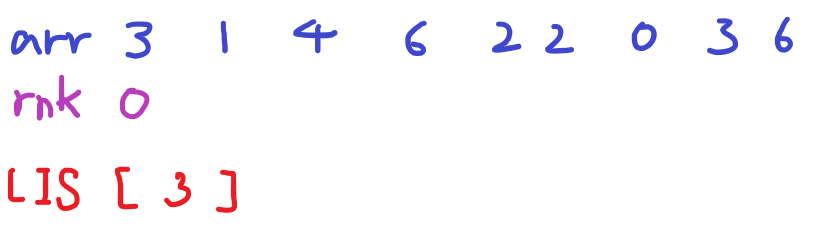

그 다음 값은 1이다.

1은 3보다 작으니 LIS에서 바꿔준다. LIS에서의 인덱스 위치도 0이므로 rank도 0이다.

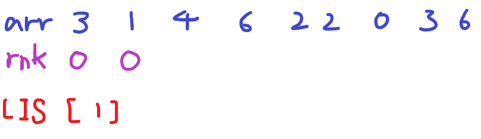

다음 값은 4이다.

4는 1보다 크므로 뒤에 붙인다. rank는 LIS에서의 인덱스 값인 1이 된다.

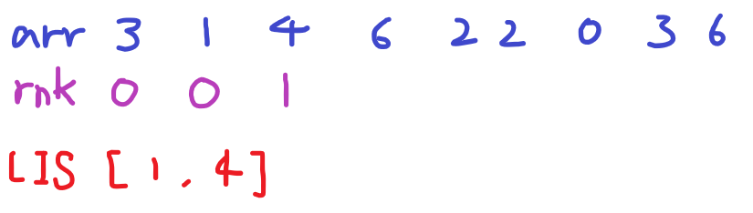

다음 값은 6이다.

6도 4보다 크므로 뒤에 붙인다. rank는 2가 된다.

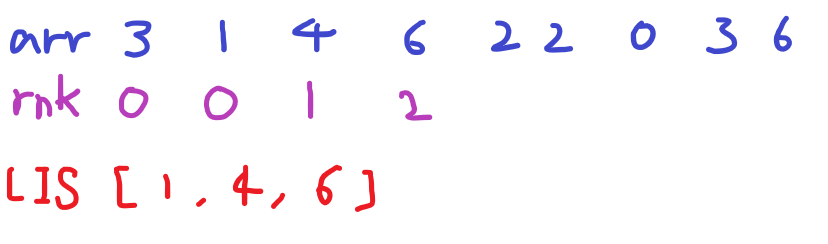

다음 값은 2이다.

2는 6보다 작으므로 LIS 중 크거나 같은 값 중 가장 작은 값과 바꿔준다. LIS의 4에 2를 넣고 그 때의 index 값인 1을 rank에 적는다.

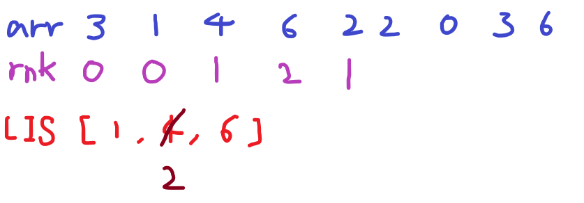

다음 값은 2이다.

2는 6보다 작으므로 LIS 중 크거나 같은 값 중 가장 작은 값과 바꾼다. 2와 바꾸면 된다. rank는 1이다.

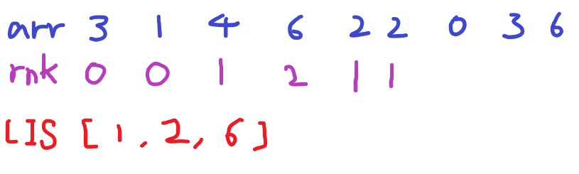

다음 값은 0이다.

0은 6보다 작고 0보다 크거나 같은 수 중 가장 작은 값은 1이다. 1과 바꾸고 그 때의 index 값인 0을 rank에 적는다.

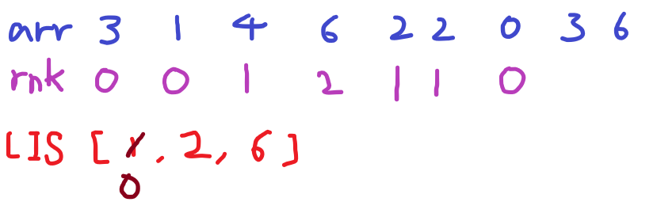

다음 값은 3이다.

3은 6보다 작고 0보다 크거나 같은 수 중 가장 작은 값은 6이다. 6과 바꾸고 그 때의 index 값인 2를 rank에 적는다.

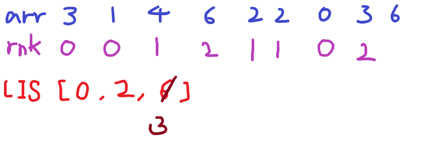

다음 값은 6이다.

6은 3보다 크니 LIS에 추가한다. rank는 3이다.

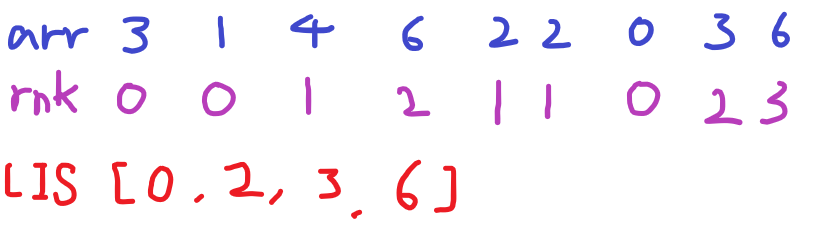

LIS의 개수는 LIS만으로 구할 수 있지만, 부분 수열 값은 LIS에 적힌 DP 값과 다르다.

LIS에는 0 2 3 6이 적혀있지만, 부분 수열의 답은 1 2 3 6이다.

구하는 방법은 rank를 뒤에서부터 확인하며 숫자가 큰 값부터 역순으로 result에 담아주면된다.

LIS DP의 길이가 4이므로 3부터 찾아서 그때의 값을 result에 담아준다.

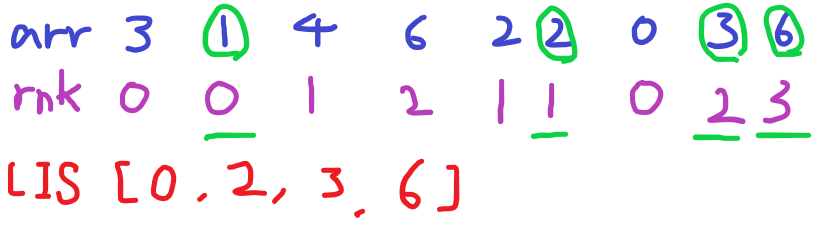

그러면 초록색 동그라미 친 값들을 result에 담아주는 것이다.

> result = [6, 3, 2, 1]

result에 역순으로 담겨있으니 `[::-1]`로 뒤집은 후 unpacking 연산자를 활용해 출력한다.

## 📒 코드

```python
def binary_search(x):   # 매개변수 탐색(이진 탐색)
    s, e = 0, len(lis) - 1
    ans = 0
    while s <= e:
        mid = (s + e) // 2
        if lis[mid] == x:   # 같은 수가 있다면 return
            return mid
        elif lis[mid] > x:  # 큰 수 중 가장 작은 수를 매개변수 탐색
            ans = mid
            e = mid - 1
        else:
            s = mid + 1
    return ans


n = int(input())
arr = list(map(int, input().split()))
lis = [arr[0]]  # 시작부분을 넣어준다.
rnk = [0 for _ in range(n)] # arr의 각 수의 lis에서의 순서를 담아준다.
for i in range(1, n):
    num = arr[i]
    if lis[-1] < num:       # lis 값들보다 크면 맨 오른쪽에 삽입
        lis.append(num)
        rnk[i] = len(lis) - 1   # lis에서의 순서를 담아준다.
    elif lis[-1] > num:     # lis의 가장 큰 수보다 작으면 크거나 같은 값들 중 가장 작은 수와 바꾼다.
        index = binary_search(num)
        lis[index] = num
        rnk[i] = index          # index의 위치를 담아준다.
    else:
        rnk[i] = len(lis) - 1   # 같은 경우는 순서가 맨 뒤 값이랑 동일

prv = len(lis) - 1
result = []
for i in range(n)[::-1]:    # rnk를 거꾸로 세며 역순으로 값을 담는다.
    if rnk[i] == prv:
        result.append(arr[i])
        prv -= 1
        if prv < 0:         # 다 담았으면 종료한다.
            break

print(len(result))          # 길이를 출력
print(*result[::-1])        # 역순으로 담은 result를 다시 뒤집고 출력한다.
```

## 🔍 결과

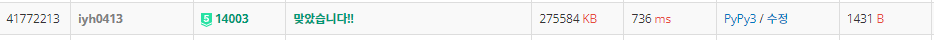