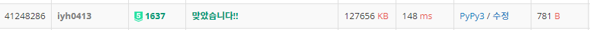

# [Baekjoon] 1637. 날카로운 눈 [P5]

## 📚 문제

https://www.acmicpc.net/problem/1637

---

## 📖 풀이

정수가 엄청나게 많다. 최대 대략 10억 * 20000번의 연산이 필요하므로 담는 순간 시간초과가 발생한다.

매개변수 탐색을 활용해본다. 홀수개 존재하는 정수가 하나만 있으므로 특정 정수 이하의 개수를 센다.

그러면 다음과 같이 나온다.

> 짝 짝 짝 짝 홀 홀 홀 홀 홀 홀 ....

왜냐하면 홀수개 존재하는 정수보다 작은 특정 수 이하의 정수들의 개수는 무조건 짝수이다.

홀수개 존재하는 정수보다 크거나 같은 정수 이하의 개수들은 무조건 홀수가 나온다.

예를 들면,

> 1: 2
>
> 2: 2
>
> 3: 2
>
> 4: 3
>
> 5: 2
>
> 6: 2

위처럼 수들이 존재한다고하면 4만 홀수개 존재할 때이다. 이 때 4보다 작은 정수 이하의 개수를 세면 무조건 짝수가 나온다. 

ex). 1이하의 정수는 2, 2이하의 정수는 4, 3이하의 정수는 6


홀수개 존재하는 4보다 크거나 같은 정수 이하의 개수는 무조건 홀수이다.

ex). 4이하의 정수는 9, 5이하의 정수는 11, 6이하의 정수는 13


따라서 특정 정수 이하의 정수들의 개수가 홀수인 것 중 가장 작은 값을 찾으면 그 때가 우리가 찾는 홀수개 존재하는 정수이다. 홀수가 True라고 하면

> xxxxxooooooooooo...

위와 같이 탐색할 수 있다. 그러면 이진탐색을 활용해 매개변수 탐색을 통해 True가 나온 값 중 맨 왼쪽 값을 구한다. 그러기 위해 True가 나오면 mid 오른쪽을 버리고, False가 나오면 mid 왼쪽을 버리며 탐색해나간다.


이제 x이하의 정수들의 개수를 탐색하기 위한 함수를 작성한다.

입력 받은 a, c, b는 range로 생각하면 (a, c + 1, b)이다. 이 때 내가 구한 x가 이 구간 안에 몇 개가 속해있는지 찾으면 된다.

일단 x가 a보다 크거나 같아야 하나 이상 존재한다.

그리고 x가 a보다 크면 x - a와 c - a 중 최소 값을 골라  b로 나눈 몫에 1을 더해준다.

x와 c 중 최소값을 고르는 이유는 최댓값인 10 이후로 더 수가 나올 수 없기 때문이다.

몫에 1을 더하는 이유는 A + B, A + 2B ... 만 있는게 아니라 A도 있기 때문에 1을 더해준다.

입력받은 20000개 모두 해주고 나온 결과를 더해주면 x 이하의 정수들의 개수를 구한 것이다.

그러면 이 때 홀수이면 True를 리턴하고, 짝수이면 False를 리턴한다.


그리고 정수가 몇 개 들어있는지 출력해야 하기 때문에 x의 개수를 찾는 함수를 하나 더 만든다.

이 때는 위에 구했던 함수가 몫을 구하는 연산을 했다면 모듈러 연산을 통해 안에 있는지 확인하면 된다.

그리고 a보다 크거나 같고 c보다 작거나 같을 때 x - a가 b로 나누어 떨어지는지 확인하면 된다.

그 때 나온 값들을 모두 더한 값이 개수이다.


홀수개 존재하는 정수가 무조건 있는지 알았는데 없는 경우도 존재했다.

이 때에는 NOTHING을 출력하도록 조건문을 작성한다.

## 📒 코드

```python
import sys
input = sys.stdin.readline


def check(x):   # x이하의 정수들의 개수가 홀수인지 체크
    cnt = 0
    for a, c, b in arr:
        if a <= x:      # a보다 크거나 같은 경우만 있다.
            cnt += min((c - a), (x - a)) // b + 1       # 몫을 활용
    if cnt % 2:         # 홀수면 True
        return True
    else:
        return False

def counting(x):   # x의 개수를 찾는다.
    cnt = 0
    for a, c, b in arr:
        if x < a or x > c:
            continue
        if (x - a) % b == 0:    # 모듈러 연산으로 값이 있는지 확인
            cnt += 1
    return cnt

n = int(input())
arr = [list(map(int, input().split())) for _ in range(n)]

s, e = 1, 2_147_483_647
ans = -1
while s <= e:               # 이진탐색
    mid = (s + e) // 2
    if check(mid):          # x이하의 정수들의 개수 홀수인 것중 가장 작은 정수를 찾는다.
        ans = mid           # 매개변수 탐색
        e = mid - 1
    else:
        s = mid + 1
if ans == -1:               # 없으면 NOTHING 출력
    print('NOTHING')
else:
    print(ans, counting(ans))
```

## 🔍 결과

