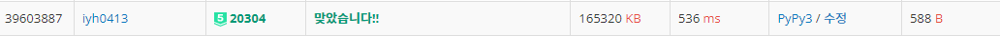

# [Baekjoon] 20304. 비밀번호 제작 [P5]

## 📚 문제

https://www.acmicpc.net/problem/20304

---

비트 연산자를 활용하는 비트 마스킹 문제이다.

N이 백만으로 주어지니 N을 for문 돌려서 완전탐색으로 구하면 무조건 시간초과가 걸린다.

따라서 비트 마스킹 + bfs를 활용하여 해결한다.

>visited에 N길이의 배열을 만들고 -1로 초기화한다. visited에 안전도를 나타낸다.
>
>입력 받은 로그인 시도에 사용된 비밀번호들은 안전도가 무조건 0일 수밖에 없다.
>
>따라서 큐에 담으며, visited에 관련 비밀번호들을 0으로 바꿔준다.
>
>큐에서 하나씩 꺼내며 bit를 한자리씩 바꿔준다. 1, 10, 100, 1000 ... N이 나올 수 있는 가장 큰 자릿수 까지 바꿔준다.
>
>1을 한 자리씩 옮기기 위해 `1<<i` 비트 shift 연산자를 활용하고, 관련 자릿수를 바꿔주기 위해 `1^바꿀 수` ^(xor)연산자를 활용한다.
>
>이렇게 한자리씩 바꿔주면 이제 안전도가 하나씩 커진 수를 찾을 수 있다. visited에 기록해주고 다시 큐에 담는 걸 반복한다.
>
>큐에서 꺼낼 때 이미 안전도가 확인된 숫자들은 pass하고 확인하니 가지치기를 통해 경우의 수를 줄일 수 있다.
>
>게다가 경우의 수가 더 적은 경우는 앞에서 걸러지므로 제일 높은 안전도가 나왔을 때 그 값을 출력한다.
>
>0이 들어오는건 예외처리 해줘야 한다. 

## 📒 코드

```python
from collections import deque

N = int(input())    # 비밀번호 최댓값 정수 N
M = int(input())    # 시도한 비밀번호 개수
queue = deque(map(int, input().split()))
visited = [-1 for _ in range(N+1)]      # visited에 bit의 차이만큼 적어준다.

temp = N        # bit의 자릿 수를 구하기 위해 따로 만들어준다.
cnt = 0         # N까지의 bit 수
while temp:
    temp //= 2  # 2로 나누며 bit 수를 찾아준다.
    cnt += 1

for i in queue:     # queue에 담으면서 visited에 0으로 적는다.
    visited[i] = 0  # bit의 차이가 없으므로

while queue:        # queue에 존재할 때 반복
    v = queue.popleft()     
    for i in range(cnt):    # 자릿수마다 bit를 바꿔준다.
        nv = v ^ (1 << i)   # bit를 하나 바꾼다. bit 차이는 1 더한다.
        if nv <= N and (visited[nv] == -1): # 아직 나오지 않은 것만 확인
            visited[nv] = visited[v] + 1    # queue에 담을 때 bit가 달라졌음을 적어준다.
            queue.append(nv)

if N:               # N이 0이 아닌 수 제거
    print(max(visited))
else: print(0)      # 0이 들어오면 0뿐이다.
```

## 🔍 결과




