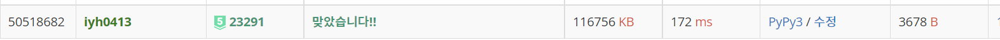

# [Baekjoon] 23291. 어항 정리 [P5]

## 📚 문제 : [어항 정리](https://www.acmicpc.net/problem/23291)

## 📖 풀이

2차원 배열의 값 복사와 2차원 배열의 회전에 대해 복잡하게 나온 문제이다. 문제를 풀어보며 예전에 실수했던 배열 회전에 대해 다시 짚어보고 갈 수 있었다.

문제가 복잡해서 하나씩 쪼개서 생각했다.

1. ### clean() : 1회 어항 정리 시 진행되는 과정을 담은 함수

   ```python
   # 어항 정리
   def clean():
       fill_fish()
       turn_stack(0)
       fish_move()
       change_row()
       half_stack(0)
       fish_move()
       change_row()
   ```

   먼저 어항 정리하는 함수를 하나 만들고, 한 번 시행될 동안 변화하는 함수를 다 만들었다.

   - fill_fish()는 물고기가 가장 적은 개수들의 어항을 찾아 하나씩 증가시키는 함수이다.

   - turn_stack()은 초반 어항을 쌓는 과정이다.
   - fish_move()는 인접한 어항으로 물고기를 옮겨줄 때 사용하는 함수이다.
   - change_row()는 2차원 배열을 일렬로 만드는 함수이다.
   - half_stack()은 절반으로 쪼개 어항을 쌓는 과정이다.

2. ### fill_fish() : 물고기가 가장 적은 어항에 물고기를 넣는 함수

   ```python
   # 처음에 물고기 채우기
   def fill_fish():
       min_cnt = min(arr[0])
       for i in range(len(arr[0])):
           if min_cnt == arr[0][i]:
               arr[0][i] += 1
   ```

3. ### turn_stack() : 초반에 어항을 돌려 쌓는 함수

   어항을 돌려서 쌓을 수 있는지 처음에 확인한다.

   홀수 번 회전인 경우와 짝수 번 회전인 경우를 나누어 확인한다.

   ```python
   # 어항을 돌린 후 올리기
   def turn_stack(cur):
       global arr
       r, c = len(arr), len(arr[0])
       # 홀수 번 회전인 경우
       if not (cur % 2):
           if r * 2 > c:       # 어항의 범위를 넘어서는 경우
               return
       # 짝수 번 회전인 경우
       else:
           if r * 2 - 1 > c:   # 어항의 범위를 넘어서는 경우
               return
       copy_arr = [arr[i][:] for i in range(len(arr))]
   
       x, y = pick(r, c)   # 회전할 박스 선택
       box = [arr[i][:y][:] for i in range(x)]
       box = turn_90(box, x, y)
       arr = [[0] * (c - y) for _ in range(y + 1)]
   
       # 첫줄 만들기
       for i in range(c - y):
           arr[-1][i] = copy_arr[-1][y + i]
   
       # 회전한 박스 쌓기
       for i in range(len(box)):
           for j in range(len(box[0])):
               arr[i][j] = box[i][j]
       turn_stack(cur + 1)
   ```

   값을 복사할 때 2차원 배열에 슬라이싱을 활용해 복사한다.

   pick() 함수로 회전시킬 배열을 찾고, turn_90() 함수를 만들어 사용해 회전시킨다.

   - pick(), turn90()

     ```python
     # 현재 회전할 박스 선택
     def pick(r, c):
         if r == 1:
             return 1, 1
         else:
             for i in range(c):
                 if arr[0][i] == 0:
                     return r, i
     
     
     # 박스 90도 회전
     def turn_90(box, x, y):
         turn_box = [[0] * x for _ in range(y)]
         for i in range(y):
             for j in range(x):
                 turn_box[i][j] = box[x - j - 1][i]
         return turn_box
     ```

   기존에 남아있는 row를 맨 아래 두고 그 위로 회전한 박스를 쌓아준다.

4. ### fish_move() : 인접한 어항끼리 물고기를 옮겨주는 함수

   2차원 배열을 복사하고 배열을 바꿔준다.

   이 때 각 어항의 오른쪽과 아래쪽의 인접한 어항끼리 비교해, 값이 더 작은 쪽으로 물고기 차이를 5로 나눈 몫 만큼의 물고기를 옮겨준다.

   현재 어항 또는 인접한 어항이 0인 경우는 옮기지 않는다.

   ```python
   # 물고기 수 조절
   def fish_move():
       global arr
       copy_arr = [arr[i][:] for i in range(len(arr))]
       r, c = len(arr), len(arr[0])
       for x in range(r):
           for y in range(c):
               if arr[x][y] == 0:
                   continue
               for k in range(2):  # 오른쪽 아래만 확인
                   nx = x + dx[k]
                   ny = y + dy[k]
                   if not(0 <= nx < r and 0 <= ny < c) or not arr[nx][ny]:
                       continue
                   move_fish = abs(copy_arr[x][y] - copy_arr[nx][ny]) // 5
                   if copy_arr[x][y] > copy_arr[nx][ny]:
                       arr[x][y] -= move_fish
                       arr[nx][ny] += move_fish
                   elif copy_arr[x][y] < copy_arr[nx][ny]:
                       arr[x][y] += move_fish
                       arr[nx][ny] -= move_fish
   ```

5. ### change_row() : 2차원 배열을 일렬로 바꿔주는 함수

   0이 아닌 배열을 왼쪽 아래부터 위로 확인하며 하나의 열로 이루어진 배열에 채워준다.

   ```python
   # 어항을 다시 일렬로
   def change_row():
       global arr
       copy_arr = [arr[i][:] for i in range(len(arr))]
       r, c = len(arr), len(arr[0])
       arr = [[]]
       for i in range(c):
           for j in range(r):
               if copy_arr[r - j - 1][i] != 0:
                   arr[0].append(copy_arr[r - j - 1][i])
   ```

6. ### half_stack() : 절반으로 나누어 쌓아주는 함수

   위에 회전해서 쌓아주는 것과 로직이 비슷한데, 둘로 나누어 180도 회전 후 쌓아주는 것이 다르다. 180도 회전은 위에서 구한 90도 회전 함수를 2번 사용하면 된다.

   ```python
   # 반으로 쪼개서 쌓기
   def half_stack(cur):
       global arr
   
       if cur == 2:    # 2번만 시행
           return
   
       r, c = len(arr), len(arr[0])
       copy_arr = [arr[i][:] for i in range(len(arr))]
   
       box = [arr[i][:c // 2][:] for i in range(r)]
       # 180도 돌리기
       box = turn_90(box, r, c // 2)
       box = turn_90(box, c // 2, r)
       arr = [[0] * (c // 2) for _ in range(r * 2)]
   
       for i in range(r):
           for j in range(c // 2):
               # 하단 박스 놓기
               arr[i + r][j] = copy_arr[i][j + c // 2]
               # 회전한 박스 놓기
               arr[i][j] = box[i][j]
       half_stack(cur + 1)
   ```

입력으로 주어진 배열을 2차원 배열인데 행이 1인 배열로 만들어준다. 

어차피 2차원을 다루니 이렇게 바꿔서 확인하는 것이 편하다.

회전이나 일렬로 만드는 로직같은 경우는 그냥 마구잡이로 생각해서 찾으려고 하면 헷갈린다. 따라서 직접 배열의 인덱스를 넣어 손으로 그려본 후, 어떻게 바꾸면 될지 생각하면 좀 더 편하다.

## 📒 최종 코드

```python
# 어항을 돌린 후 올리기
def turn_stack(cur):
    global arr
    r, c = len(arr), len(arr[0])
    # 홀수 번 회전인 경우
    if not (cur % 2):
        if r * 2 > c:       # 어항의 범위를 넘어서는 경우
            return
    # 짝수 번 회전인 경우
    else:
        if r * 2 - 1 > c:   # 어항의 범위를 넘어서는 경우
            return
    copy_arr = [arr[i][:] for i in range(len(arr))]

    x, y = pick(r, c)   # 회전할 박스 선택
    box = [arr[i][:y][:] for i in range(x)]
    box = turn_90(box, x, y)
    arr = [[0] * (c - y) for _ in range(y + 1)]

    # 첫줄 만들기
    for i in range(c - y):
        arr[-1][i] = copy_arr[-1][y + i]

    # 회전한 박스 쌓기
    for i in range(len(box)):
        for j in range(len(box[0])):
            arr[i][j] = box[i][j]
    turn_stack(cur + 1)


# 반으로 쪼개서 쌓기
def half_stack(cur):
    global arr

    if cur == 2:    # 2번만 시행
        return

    r, c = len(arr), len(arr[0])
    copy_arr = [arr[i][:] for i in range(len(arr))]

    box = [arr[i][:c // 2][:] for i in range(r)]
    # 180도 돌리기
    box = turn_90(box, r, c // 2)
    box = turn_90(box, c // 2, r)
    arr = [[0] * (c // 2) for _ in range(r * 2)]

    for i in range(r):
        for j in range(c // 2):
            # 하단 박스 놓기
            arr[i + r][j] = copy_arr[i][j + c // 2]
            # 회전한 박스 놓기
            arr[i][j] = box[i][j]
    half_stack(cur + 1)


# 현재 회전할 박스 선택
def pick(r, c):
    if r == 1:
        return 1, 1
    else:
        for i in range(c):
            if arr[0][i] == 0:
                return r, i


# 박스 90도 회전
def turn_90(box, x, y):
    turn_box = [[0] * x for _ in range(y)]
    for i in range(y):
        for j in range(x):
            turn_box[i][j] = box[x - j - 1][i]
    return turn_box


# 어항 정리 완료했는지 확인
def check_complete():
    if k >= max(arr[0]) - min(arr[0]):
        return True
    else:
        return False


# 처음에 물고기 채우기
def fill_fish():
    min_cnt = min(arr[0])
    for i in range(len(arr[0])):
        if min_cnt == arr[0][i]:
            arr[0][i] += 1


# 물고기 수 조절
def fish_move():
    global arr
    copy_arr = [arr[i][:] for i in range(len(arr))]
    r, c = len(arr), len(arr[0])
    for x in range(r):
        for y in range(c):
            if arr[x][y] == 0:
                continue
            for k in range(2):  # 오른쪽 아래만 확인
                nx = x + dx[k]
                ny = y + dy[k]
                if not(0 <= nx < r and 0 <= ny < c) or not arr[nx][ny]:
                    continue
                move_fish = abs(copy_arr[x][y] - copy_arr[nx][ny]) // 5
                if copy_arr[x][y] > copy_arr[nx][ny]:
                    arr[x][y] -= move_fish
                    arr[nx][ny] += move_fish
                elif copy_arr[x][y] < copy_arr[nx][ny]:
                    arr[x][y] += move_fish
                    arr[nx][ny] -= move_fish


# 어항을 다시 일렬로
def change_row():
    global arr
    copy_arr = [arr[i][:] for i in range(len(arr))]
    r, c = len(arr), len(arr[0])
    arr = [[]]
    for i in range(c):
        for j in range(r):
            if copy_arr[r - j - 1][i] != 0:
                arr[0].append(copy_arr[r - j - 1][i])


# 어항 정리
def clean():
    fill_fish()
    turn_stack(0)
    fish_move()
    change_row()
    half_stack(0)
    fish_move()
    change_row()


n, k = map(int, input().split())
arr = [list(map(int, input().split()))]
dx, dy = [0, 1], [1, 0]     # 우, 하
cnt = 0
while not check_complete():
    cnt += 1
    clean()

print(cnt)

```

## 🔍 결과

