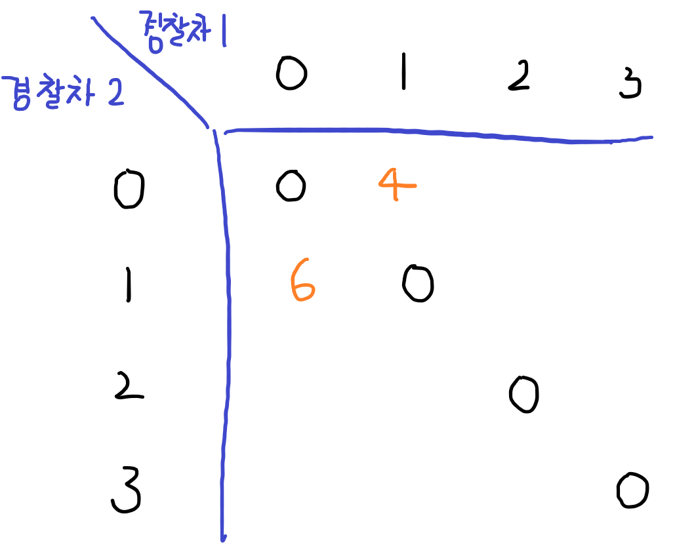
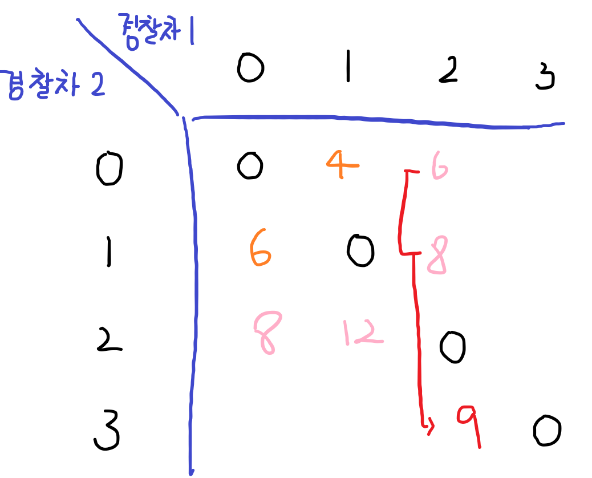
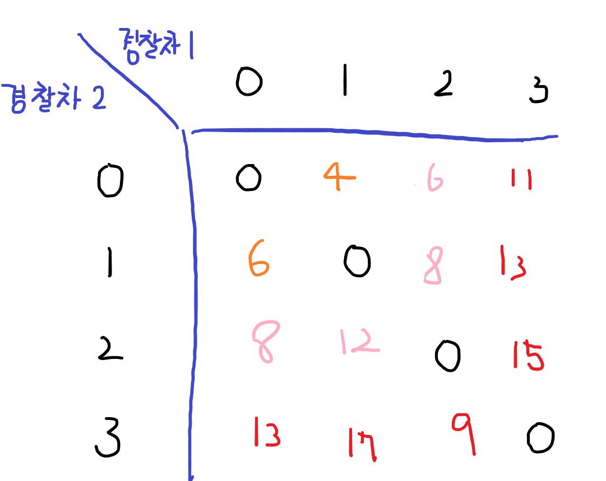
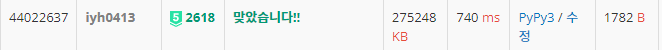

# [Baekjoon] 2618. 경찰차 [P5]

## 📚 문제 : [경찰차](https://www.acmicpc.net/problem/2618)

## 📖 풀이

사건의 개수 1000개면 모든 경우의 수를 구할 땐, 2의 1000제곱이다. 시간 제한이 1초인 경우는 대략 2의 25제곱까지 가능하니 모든 경우를 구하려고 하면 불가능하다. 따라서 DP로 해결한다.

출동횟수 후 경찰차의 위치를 적어보면 다음과 같다.

>0 : [0, 0]
>
>1 : [1, 0] [0, 1]
>
>2 : [2, 0] [0, 2] [1, 2] [2, 1]
>
>3 : [2, 3] [0, 3] [1, 3] [3, 0] [3, 1] [3, 2]

각 출동 횟수 이후 경찰차는 항상 해당 출동 횟수가 하나만 나와야 한다. 즉 n인 경우는 2 * n만큼의 경우의 수가 생긴다.

n이 1000이면 (2000 + 2001) / 2이므로, 2^n인 모든 경우의 수를 구하지 않고 해결할 수 있다.


2차원으로 배열을 선언하여 DP를 만들었다.

DP 테이블에는 경찰차가 이동할 때 x, y 좌표에는 경찰차의 위치이고 그 때의 총 이동거리를 값에 넣어준다.


1. 한 번의 출동에는 하나의 경찰차만 출동하므로 x, y좌표가 같은 경우는 존재하지 않는다. 따라서 그 값은 항상 0이 나온다. 그리고 첫 출동에 각각 이동한 값을 넣어준다.

   4랑 6이 나오는 이유는 입력으로 받은 출동위치인 3,5로 각각 이동한 것이다.

   

2. 두 번째 출동할 땐 같은 라인의 수들을 이용해 값을 찾아준다.

   

3. 세 번째 출동할 때부터 보면 좀 더 정확한 규칙들을 찾을 수 있다.

   - 경찰차의 출동 위치가 다른 경찰차 위치랑 하나 차이나는 경우

     이 때에는 여러 가지 경우의 수들 중 최소 이동거리 값을 찾아 넣어준다.

     

   - 아닌 경우는 2번째에서 구한 것처럼 인접한 좌표에서 이동한 거리를 찾아 넣어준다. 그럼 다음과 같이 구할 수 있다.

     

위 규칙을 이용해 작성하여 맨 테두리의 값 중 가장 작은 값을 찾으면 그게 경찰차가 이동한 최소 거리이다.

9가 가장 작으므로 9가 최소 거리인데 이 때 경찰차 번호를 추적하기 위해서 역추적 방법을 사용한다.

DP 역추적을 활용하기 위해서 우리는 경찰차의 거리를 적으면서 visited 배열에 이전 경찰차들의 좌표를 담아준다.

역추적 시 이전 경찰차의 좌표와 다른 좌표가 무엇인지 확인하며 경찰차 1이 움직였는지 경찰차 2가 움직였는지 파악할 수 있다. 그리고 배열에 담아준다.

배열에 담은 걸 하나씩 꺼내 출력하면 순서대로 경찰차를 출력할 수 있다.

## 📒 코드

```python
def distance(a, b):     # 경찰차가 이동한 거리
    return abs(a[0] - b[0]) + abs(a[1] - b[1])


def traceback(x, y, order):     # 경찰차 좌표를 역추적하여 어떤 경찰차가 움직였는지 찾는다.
    if x == 0 and y == 0:
        return order
    
    prv = visited[x][y]         # visited에 담은 이전 경찰차 좌표
    if prv[0] == x:
        return traceback(*prv, [2] + order)     # 이전 좌표와 경찰차 1의 위치가 같으니 경찰차 2가 움직인 것
    else:
        return traceback(*prv, [1] + order)     # 이전 좌표와 경찰차 2의 위치가 같으니 경찰차 1이 움직인 것

n = int(input())
w = int(input())
arr = [[[0, 0], [0, 0]] for _ in range(w + 1)]  # 경찰차들의 좌표를 담아준다.
arr[0][0] = [1, 1]      # 경찰차 1의 초기 위치
arr[0][1] = [n, n]      # 경찰차 2의 초기 위치
for i in range(1, w + 1):       # 경찰차가 해당 출동에 의해 움직이는 좌표
    arr[i][0] = list(map(int, input().split()))
    arr[i][1] = arr[i][0]       # 출동하는 위치는 동일(초기 위치가 다르니 2차원으로 적는 것!)

dp = [[0] * (w + 1) for _ in range(w + 1)]      # 중복을 계산을 제거하기 위해 DP 활용
visited = [[[0, 0] for _ in range(w + 1)] for _ in range(w + 1)]    # 이전 경찰차 좌표를 담아준다.(역추적 하기 위함)

# 기저조건 : 첫 출동에 의해 움직이는 거리
dp[1][0] = distance(arr[0][0], arr[1][0])       
dp[0][1] = distance(arr[0][1], arr[1][1])

for i in range(2, w + 1):
    d1 = distance(arr[i][0], arr[i-1][0])
    d2 = distance(arr[i][1], arr[i-1][1])
    for j in range(0, i):
        if j == i-1:    # 출동 횟수가 1 차이나는 경우
            dp[i][j] = 100000000
            dp[j][i] = 100000000
            for k in range(j):  # 최소의 이동거리 값을 찾는다.
                d1 = distance(arr[k][0], arr[i][0])
                d2 = distance(arr[k][1], arr[i][1])
                if dp[i][j] > dp[k][j] + d1:
                    dp[i][j] = dp[k][j] + d1    # 움직인 값을 넣어준다.
                    visited[i][j] = [k, j]      # 이전 경찰차 위치 좌표를 저장
                if dp[j][i] > dp[j][k] + d2:
                    dp[j][i] = dp[j][k] + d2
                    visited[j][i] = [j, k]
        else:       
            dp[i][j] = dp[i-1][j] + d1  # 움직인 값을 넣어준다.
            dp[j][i] = dp[j][i-1] + d2
            visited[i][j] = [i-1, j]    # 이전 경찰차 위치 좌표를 저장
            visited[j][i] = [j, i-1]

result = 10000000
index = [0, 0]
for i in range(w):      # 마지막 출동까지 끝마친 경우 중 가장 최소 이동거리를 찾는다.
    if result > dp[w][i]:
        result = dp[w][i]
        index = [w, i]
    if result > dp[i][w]:
        result = dp[i][w]
        index = [i, w]

print(result)           # 최소 이동거리를 출력한다.
for police in traceback(*index, []):        # 역추적을 통해 경찰차들의 출동 순서를 출력한다.
    print(police)
```


## 🔍 결과

