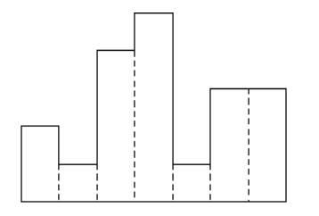
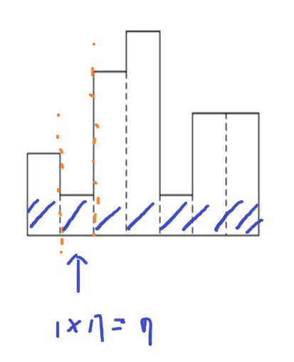
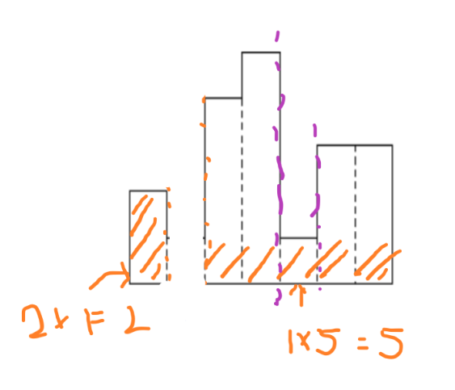
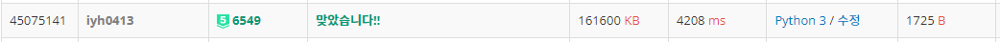

# [Baekjoon] 6549. 히스토그램에서 가장 큰 직사각형 [P5]

## 📚 문제 : [히스토그램에서 가장 큰 직사각형](https://www.acmicpc.net/problem/6549)

## 📖 풀이

높이가 10억까지 주어진다. n은 100000이다.

먼저 높이를 카운팅 배열로 쓰면 높이가 10억이니 무조건 메모리초과가 발생한다.

높이를 해결해도 n이100000이다. 단순히 완전탐색으로 해결하려고하면 O(n^2)으로 풀어도 시간초과가 발생한다.

따라서 **분할정복**으로 풀어야한다.

h가 가장 작은 인덱스를 찾고 그 때의 넓이를 구한다. 그리고 인덱스의 왼쪽에서 또 가장 작은 인덱스를 찾아 넓이를 구하고, 오른쪽에서 가장 작은 인덱스를 찾아 넓이를 구한다. 이를 반복한다.

예제를 그림으로 표현하면,



먼저 가장 작은 h 값을 찾는다.

그리고 그 때의 넓이를 구한다.



그리고 이제 왼쪽과 오른쪽으로 나눠서 확인한다.



그리고 그 떄의 넓이를 구하고 또 가장 작은 인덱스를 구하는 작업을 반복한다.

위 과정을 반복하여 답을 구한다.

가장 작은 높이를 찾을 때 다 탐색하여 검색하면 시간초과가 발생한다. 시간초과가 발생하지 않는 방법을 생각해야 한다.

구간의 최소값을 찾을 때에는 **세그먼트 트리**를 이용해야 한다.

세그먼트 트리에 그 범위에서의 최소값을 찾으면서 구하는 형태로 해결한다.

세그먼트에 값을 넣어줄 때 값과 인덱스를 함께 넣어서 해결했다.

인덱스 기준으로 양 옆으로 분할정복을 구해야하기 때문에 인덱스가 필요했고, 최소값은 비교하기 편하게 함께 담아서 비교했다.

나는 분할정복 + 세그먼트 트리로 풀었지만, 스택으로 푸는 방법이 시간이 훨씬 더 짧게 걸린다고 한다.

## 📒 코드

```python
import sys
input = sys.stdin.readline
sys.setrecursionlimit(1000000)

def tree_create(s, e, node):            # 세그먼트 트리에 최소값 담기
    if s == e:
        tree[node] = (arr[s], s)        # 최소값과 그 때의 인덱스를 담아준다.
        return tree[node]
    mid = (s + e) // 2
    left = tree_create(s, mid, node * 2)
    right = tree_create(mid + 1, e, node * 2 + 1)
    tree[node] = min(left, right)       # 최소값을 세그먼트 트리에 담아준다.
    return tree[node]


def tree_search(s, e, node, left, right):       # 세그먼트 트리로 최소값과 그 떄의 인덱스 찾기
    if left <= s and right >= e:        # 범위 안에 있는 경우
        return tree[node]
    if e < left or s > right:           # 범위 밖에 있는 경우
        return [INF, 0]
    # 범위가 걸쳐져 있는 경우
    mid = (s + e) // 2
    l = tree_search(s, mid, node * 2, left, right)
    r = tree_search(mid + 1, e, node * 2 + 1, left, right)
    if l[0] <= r[0]:            # 더 작은 값을 
        return l
    else:
        return r


def max_histogram(s, e):            # 히스토그램의 최대 직사각형 넓이 구하기
    global result
    min_val, min_idx = tree_search(1, n, 1, s, e)       # 최소값과 그 때의 인덱스 값
    result = max(result, min_val * (e - s + 1))
    if s != min_idx:
        max_histogram(s, min_idx - 1)
    if e != min_idx:
        max_histogram(min_idx + 1, e)


INF = 10000000000
while True:
    arr = list(map(int, input().split()))
    n = arr[0]
    if n == 0:
        break
    tree = [0] * n * 4      # 세그먼트 트리 초기화
    tree_create(1, n, 1)
    result = 0
    max_histogram(1, n)
    print(result)
```

## 🔍 결과


