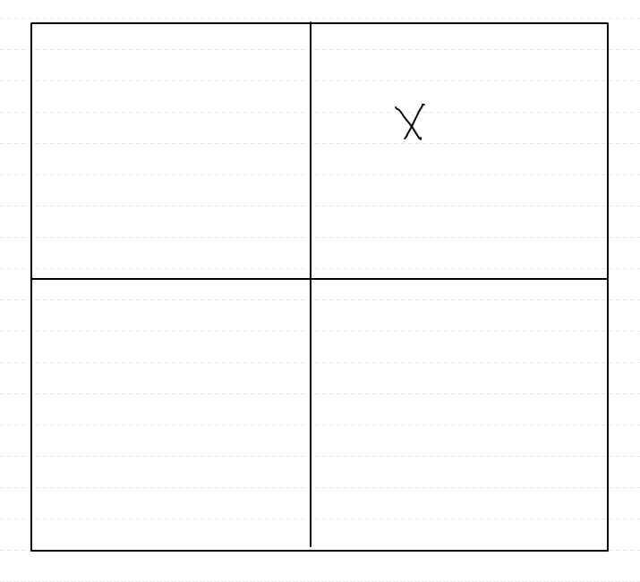
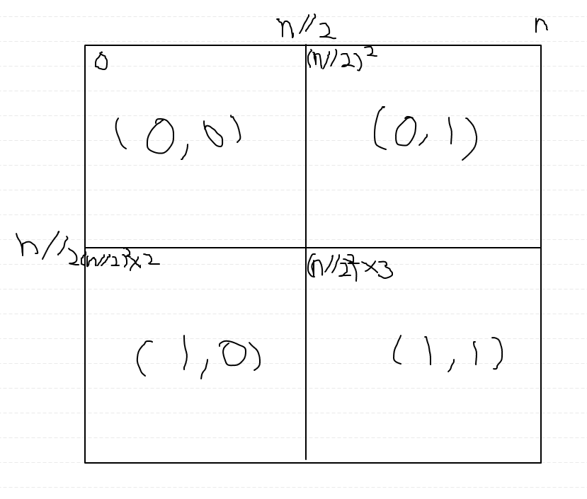
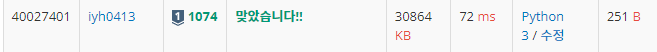

# [Baekjoon] 1074. Z [S1]

## 📚 문제

https://www.acmicpc.net/problem/1074

---

큰 사각형에서 작은 사각형을 반복해서 해결하는 **분할정복** 문제이다.

입력받은 n이 정사각형의 한 변의 길이가 아니라, 2의 n제곱만큼이 길이이니 함수에 `2 ** n`으로 제곱한 값을 넣어주어 함수에서의 입력 n은 사각형 변의 길이로 생각한다.

1. 먼저 입력받은 좌표를 찾기 위해 4 구간으로 나눠 그 중 어디에 속해있는지 찾는다.

   

   > 어디 사분면에 있는지 찾기 위해 입력받은 좌표 (y, x)를 사각형 한 변의 길이의 절반으로 나눈 몫으로 찾아준다. 그러면 (0,0), (0,1), (1,0), (1,1)로 각 사분면을 정해줄 수 있다.위 그림에서는 (0, 1)에 위치하게 된다.

2. 사분면을 정의 했으면 각 사분면의 맨 왼쪽 위 꼭짓점의 값을 찾아준다.

   사각형의 각 1/4의 크기는 입력받은 n을 2로 나누고 제곱하면 구할 수 있다. 

   

> (0, 0)에는 (n ** 2) // 2
>
> (0, 1)에는 ((n ** 2) // 2)
>
> (1, 0)에는 ((n ** 2) // 2) * 2
>
> (1, 1)에는 ((n ** 2) // 2) * 3

3. 시작부분의 값을 따로 더해주고 0으로 만들어 계산하면 재귀함수를 호출해 작은 사각형을 위와 같은 방법으로 똑같이 해결할 수 있다.

   시작 부분의 좌표 값을 활용해 작은 사각형에서 새로운 좌표값을 찾아 준다.

   > (y, x) - (시작 부분의 y, 시작 부분의 x)

   함수의 return 값에 `시작 부분의 값 + recur()`로 다시 호출하며 시작부분의 값을 더해간다.

   n이 1일 때 0을 return하게 하여 종료시킨다.

## 📒 코드

```python
def recur(n, y, x):
    if n == 1:  # 더 이상 쪼개지지 않을 때 0을 return
        return 0
    
    n //= 2     # 작은 정사각형의 변의 길이는 원래 사각형의 절반이다.
    # 4 구역 중 y, x의 어디에 위치하는지 i, j에 담아준다.
    i = y // n  
    j = x // n
    # 작은 사각형에서 시작부분의 값 + recur(작은사각형의 변의 길이, 새로운 좌표)
    return (n * n) * (2 * i + j) + recur(n, y - n * i, x - n * j)

n, r, c = map(int, input().split())
print(recur(2 ** n, r, c))
```

## 🔍 결과

