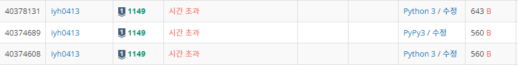
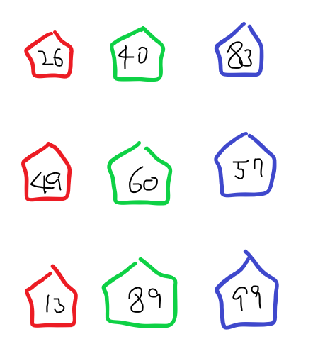
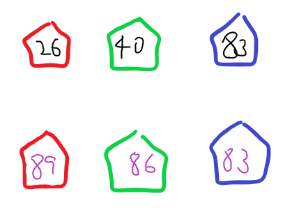
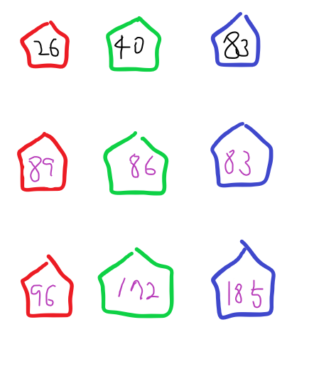
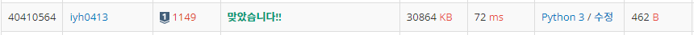

# [Baekjoon] 1149. RGB거리 [S1]

## 📚 문제

https://www.acmicpc.net/problem/1149

---

백트래킹으로 풀어보면 재귀의 깊이가 너무 깊어서 시간초과가 난다. 

## 📒 백트래킹 - 코드(시간초과)

```python
import sys
input = sys.stdin.readline


def recur(cur, total):
    global total_min
    if cur == n:
        if total < total_min:
            total_min = total
        return
    if total_min < total:
        return

    for i in range(3):
        if cur == 0 or i != visited[cur - 1]:
            visited[cur] = i
            recur(cur + 1, total + rgb[cur][i])
            visited[cur] = 0
            
            
n = int(input().rstrip())
rgb = [list(map(int, input().split())) for _ in range(n)]
visited = [0 for _ in range(n)]
total_min = 1000 * n
recur(0, 0)
print(total_min)            
```

---

그래서 stack을 활용한 DFS로 풀어본다. 재귀 안쓰고 dfs로 해결해보려하는데 마찬가지로 시간초과를 해결하지 못했다.

## 📒 DFS 코드(시간 초과)

```python
from collections import deque
import sys
input = sys.stdin.readline


def dfs(n):
    total_min = 1000 * n
    stack = deque()
    
    for i in range(3):
        stack.append((0, i, rgb[0][i]))

    while stack:
        v = stack.pop()
        if v[0] == n - 1:
            if v[2] < total_min:
                total_min = v[2]
            continue
        if total_min < v[2]:
            continue

        for i in range(3):
            if v[1] != i:
                stack.append((v[0] + 1, i, v[2] + rgb[v[0] + 1][i]))
    return total_min


n = int(input().rstrip())
rgb = [list(map(int, input().split())) for _ in range(n)]
print(dfs(n))
```

## 🔍 결과 - 시간 초과



---

결과값을 저장해가며 해결하는 DP 방법으로 풀어보았다.

rgb값을 다 저장한 후 두 번째 집부터 첫 번째 집에서 색이 다른 것 중 작은 수를 더해주면서 나아간다.

예제 1번을 그림으로 설명해본다.

- Input

  > 3
  > 26 40 83
  > 49 60 57
  > 13 89 99



각 집에 현재 집을 샀을 때 드는 비용을 적는다.

2번째 줄부터 이전의 집 중 최소의 비용으로 구매할 수 있는 금액을 현재 비용에 더해준다.



빨간 집은 이전 집 중 초록, 파랑일 때만 구매할 수 있다. 초록이 40으로 더 적으니 49 + 40은 89이다. 초록과 파랑도 다음과 같이 구해서 수를 바꿔준다.

위 같은 방법을 계속 해나간다.



마지막에 남은 세 개의 수 중 최소값을 출력한다.

## 📒 DP 코드

```python
import sys
input = sys.stdin.readline


n = int(input())
rgb = [list(map(int, input().split())) for _ in range(n)]

for i in range(1, n):   # 칠할 집들
    for j in range(3):  # 각 색칠한 집의 최소 값
        min_rgb = 1000000
        for k in range(3):  # 이전에 칠했던 집들 확인
            if j != k:      # 이전의 집과 색이 다른 것만 확인
                if min_rgb > rgb[i-1][k]:   # 최소값 찾기
                    min_rgb = rgb[i-1][k]
        rgb[i][j] += min_rgb    # 최소값을 더해준다.

print(min(rgb[n-1]))
```

## 🔍 DP 결과



백트래킹이나 DFS를 사용하면 시간초과가 발생하는지 확인하는 방법을 공부해야 한다..