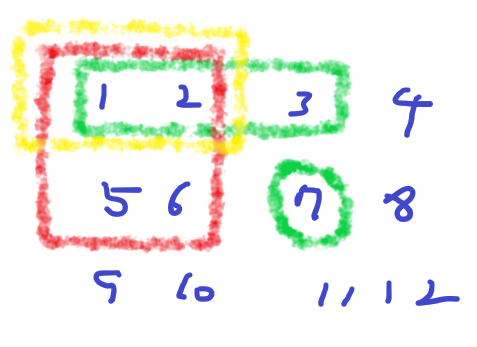
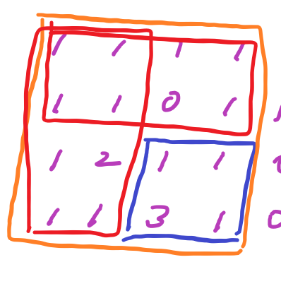

# [Baekjoon] 11660. 구간 합 구하기 5 [S1]

## 📚 문제

https://www.acmicpc.net/problem/11660

---

이 문제의 설명에 앞서 개인적으로 x, y를 행과 열로 나타내느냐의 의미에 오랫동안 씨름했다..

평소 행렬을 나타낼 때 row와 col을 i, j로 나타내면 i를 y에 j를 x에 각각 연결해서 문제를 풀었는데, 흔히 쓰는 방식이 row에 x, col에 y를 쓰는 것이었다.

이 문제에서 y, x로 주어지고 설명이 간단히 주어졌는데 관습과 다르게 풀었어서 다른 곳에서 틀렸나 한참 헤맸다..

앞으로 i, j에 x, y를 사용하도록 해야겠다.

---

다시 문제로 돌아와 이 문제는 **2차원 누적합**을 이용하는 문제이다.

(0, 0) 인덱스를 중심으로 사각형으로 누적합을 구해 각각의 인덱스에 적는다.

누적합을 적어주는 방법을 그림으로 설명해 본다.



구하고자하는 인덱스를 `(x, y)`라 한다. 위 그림으로 보면 7이 적힌 인덱스인 (2, 3)이다.

~~원래 (2, 3)을 구할 때 위와 왼쪽은 이미 구했어야 하지만 귀찮다.~~

인덱스의 위쪽 인덱스 값과 왼쪽 인덱스 값은 이미 누적합을 계산한 상황이다. 따라서 두 개를 더하면 중복된 값이 빨간색 박스와 초록색 박스처럼 나타난다. `(x - 1, y) + (x, y - 1)`를 더한다.

여기서 겹치는 노란색 박스를 빼주면 되니까 `(x - 1, y - 1)`의 값을 빼준다.

따라서 이중 for문을 돌며 현재 값에 왼쪽과 위쪽 값을 더하고 대각선 왼쪽 위 값을 빼면 된다.


누적합을 구했으면 이제 원하는 구간의 합을 쉽게 구할 수 있다.


위 그림은 (3, 3)에서 (4, 4) 사이 값을 구하는 예제이다.

위 그림은 누적합으로 적혀 있지 않지만, 현재 모든 값이 누적합으로 적혀있다고 생각하자!(~~누적합으로 적을 수 있는데 귀찮다~~)

모두 시작점을 기준으로 누적합이 되어있으니 상자를 빼고 더하는 것으로 생각할 수 있다.



노란색 박스에서 빨간색 박스 2개를 뺀다. 그러면 빨간색이 겹치는 부분이 한 번 더 빼지니까 그 부분을 더해줘야 한다.

값으로 보면, 


구하고자 하는 인덱스인 오른쪽 아래 인덱스 (x2, y2) 값에서 위쪽인 (x1 - 1, y2)를 빼고 왼쪽인 (x2, y1 - 1)을 뺀다.

그리고 중복으로 빼준 겹치는 부분을 더해주기 위해 맨왼쪽 위인 (x1 - 1, y1 - 1)을 더해준다.

## 📒 코드

```python
import sys
input = sys.stdin.readline

n, m = map(int, input().split())
arr = [[0 for _ in range(n + 1)]] + [[0] + list(map(int, input().split())) for _ in range(n)]

for i in range(1, n + 1):
    for j in range(1, n + 1):
        arr[i][j] += arr[i - 1][j] + arr[i][j - 1] - arr[i - 1][j - 1]

for i in range(m):
    x1, y1, x2, y2 = map(int, input().split())
    print(arr[x2][y2] - arr[x2][y1 - 1] - arr[x1 - 1][y2] + arr[x1 - 1][y1 - 1])
```

## 🔍 결과

