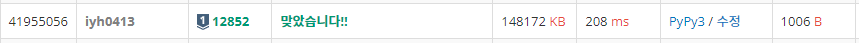

# [Baekjoon] 12852. 1로 만들기 2 [S1]

## 📚 문제

https://www.acmicpc.net/problem/12852

---

## 📖 풀이

**BFS** 문제이다.

역추적으로 1부터 출발하여 1을 더하고 2, 3을 곱하는 방식으로 생각해서 풀어봤지만, 입력 받은 n으로부터 나누어떨어지지 않는 수들까지 확인하고 저장하니 시간이 오래걸린다. 따라서 나누어떨어지는지 확인하고 넣어준다.


큐에 n을 넣고 시작한다.

큐에서 하나씩 꺼내며, 2, 3으로 나누어떨어지면 나누어주고, 1을 빼준다. 이 때 방문하지 않는 노드들만 확인해서 방문표시해주고 큐에 넣어준다.

정답을 출력해야 하므로, 방문표시할 때 인접리스트 형태로 표시한다.

이전 값의 리스트 값들에 현재 확인하는 값을 더한다.

1이 나오면 종료한다.

## 📒 코드

```python
from collections import deque


def que_add(node, nxt):         # 확인 후 visited 업데이트 및 큐에 담기
    if in_range(nxt) and visited[nxt] == []:    # 범위 체크, 방문 확인
        visited[nxt] = visited[node] + [nxt]    # 방문하지 않았으면 이전 값들을 넣어준다.
        queue.append(nxt)                       # 큐에 넣는다.


def in_range(x):                # 범위 체크
    return 0 < x <= 1000000


n = int(input())
visited = [[] for _ in range(1000001)]      # 확인한 값들을 넣어준다.
mul = [3, 2]    # 3, 2 나누기
visited[n].append(n)        # 1을 담아준다.
queue = deque()
queue.append(n)

while queue:    # BFS
    node = queue.popleft()
    if node == 1:           # n이 나왔으면 종료
        break
    for j in range(2):      # 나누기
        if node % mul[j] == 0:  # 나누어 떨어지는 경우에만
            nxt = node // mul[j]    # 나눈다.
            que_add(node, nxt)
    # -1
    nxt = node - 1
    que_add(node, nxt)

print(len(visited[1]) - 1)
print(*visited[1])
```

## 🔍 결과

