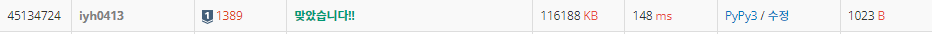

# [Baekjoon] 1389. 케빈 베이컨의 6단계 법칙 [S1]

## 📚 문제 : [케빈 베이컨의 6단계 법칙](https://www.acmicpc.net/problem/1389)

## 📖 풀이

전부 연결된 그래프가 주어진다.

최소한의 깊이로 다 연결시킬 수 있는 정점을 찾아 출력하는 문제이다.

깊이를 세면서 연결 요소를 구해야하니 **BFS**로 구한다.

이 때 visited 배열을 INF로 초기화하고 각각 노드에 도달할 때의 깊이를 visited에 넣어준다.

연결된 노드가 이미 나왔으면 확인하지 않는다.

케빈 베이컨 수는 연결된 노드에 해당하는 모든 최소 깊이의 합이다.

합한 값이 가장 작은 걸 출력한다.

## 📒 코드

```python
from collections import deque


def bfs(x):     # bfs로 입력받은 노드에서 탐색하는 깊이 출력
    visited = [INF for _ in range(n + 1)]       # 각각의 노드에 방문한 최소 깊이를 담을 visited 배열
    que = deque()
    que.append(x)
    visited[x] = 0              # 시작한 사람의 깊이는 0
    while que:
        node = que.popleft()
        for nxt in graph[node]:
            if visited[nxt] <= visited[node] + 1:       # 더 작을 때만 업데이트
                continue
            visited[nxt] = visited[node] + 1
            que.append(nxt)
    return sum(visited[1:])

n, m = map(int, input().split())
graph = [[] for _ in range(n + 1)]      # 친구 연결 관계 그래프
for i in range(m):
    a, b = map(int, input().split())
    graph[a].append(b)      # 양방향 그래프 연결
    graph[b].append(a)
INF = 10000

result = 0              # 케빈 베이컨 수가 작은 사람의 번호, 0으로 초기화
min_d = INF         # 케빈 베이컨 수가 작은 사람의 깊이, 큰 수로 초기화
for i in range(1, n + 1):
    depth = bfs(i)
    if min_d > depth:       # 케빈 베이컨 수가 더 작을 때 업데이트
        min_d = depth
        result = i

print(result)
```

## 🔍 결과

