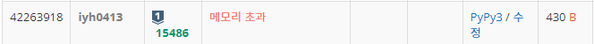
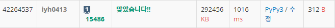

# [Baekjoon] 15486. 퇴사 2 [S1]

## 📚 문제

https://www.acmicpc.net/problem/15486

---

## 📖 풀이

n이 1,500,000로 주어져 있으니 백트래킹으로 풀면 시간초과가 발생한다.

따라서 DP로 풀어야 한다.

---

앞에서 채우기보단, 뒤쪽 날짜부터 채워나가는 방식이 더 간단하다.

상담을 했을 때와 안 했을 때 중 더 큰 값을 넣어준다.

상담을 했을 때도 상담을 할 수 있는지 먼저 파악한다. 현재 기준 상담 날짜를 더한 dp 값이 존재할 때만 상담을 할 수 있다. 없다면 상담을 안하는 경우인 바로 이전 값을 넣어준다.

상담 날짜를 더한 dp 값에 상담금액을 더한 상담을 했을 때와, 바로 이전 날짜인 상담을 안 했을 때를 비교해 더 큰 값을 넣어준다.

---

표로 설명하기위해 바텀업 방식으로 생각하면 아래와 같다.

예제로 주어진 입력을 받아온다.

|      | 1    | 2    | 3    | 4    | 5    | 6    | 7    |
| ---- | ---- | ---- | ---- | ---- | ---- | ---- | ---- |
| 날짜 | 3    | 5    | 1    | 1    | 2    | 4    | 2    |
| 금액 | 10   | 20   | 10   | 20   | 15   | 40   | 200  |
|      | 45   | 45   | 45   | 35   | 15   | 0    | 0    |

1. 7일에 있는 상담은 할 수 없다. 따라서 0이다.
2. 6일에 있는 상담은 할 수 없다. 따라서 0이다.
3. 5일에 있는 상담은 할 수 있다. 2일짜리 상담이니 7일에 있는 dp 값에 15를 더해준다. 15가 이전 값이 0보다 크니 15를 넣어준다.
4. 4일에 있는 상담도 할 수 있다. 1일짜리 상담이니 5일에 있는 dp 값에 20을 더한다. 35가 이전 값인 15보다 크니 35를 넣어준다.
5. 3일에 있는 상담도 마찬가지로 10을 더해 45를 넣어준다.
6. 2일에 있는 상담은 5일짜리 상담이다. 그러면 7일에 있는 금액에 20을 더해 20이다. 상담을 한 경우는 20인데 안한 경우는 45이다. 45가 더 크므로 45를 넣어준다.
7. 1일에 있는 상담은 3일짜리 상담이다. 3일 후인 4일의 dp값이 35이니 여기다가 10을 더하면 45이다. 이전 값도 45이니 45를 넣어주면 된다.

위를 탑다운 방식으로 코드를 작성한다.

## 📒 탑다운 DP 코드

```python
import sys
sys.setrecursionlimit(1000000)
input = sys.stdin.readline

def recur(cur):
    if cur > n:
        return -100000000 
    if cur == n:
        return 0

    if dp[cur] != -1:
        return dp[cur]

    dp[cur] = max(recur(cur + 1), recur(cur + arr[cur][0]) + arr[cur][1])
    return dp[cur]

n = int(input())
arr = [list(map(int, input().split())) for _ in range(n)]
dp = [-1 for _ in range(n)]
print(recur(0))
```

## 🔍 탑다운 DP 결과



재귀 호출을 많이 하니 스택 메모리가 부족한 것 같다. 따라서 바텀업 방식으로 바꾼다.

---

---

## 📒 바텀업 DP 코드

```python
import sys
input = sys.stdin.readline

n = int(input())
arr = [list(map(int, input().split())) for _ in range(n)]
dp = [0 for _ in range(n + 1)]

for i in range(n)[::-1]:
    day, pay = arr[i]
    if day + i <= n:
        dp[i] = max(dp[day + i] + pay, dp[i + 1])
    else:
        dp[i] = dp[i + 1]
print(dp[0])
```

## 🔍 바텀업 DP 결과

