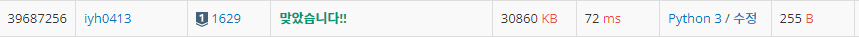

# [Baekjoon] 1629. 곱셈 [S1]

## 📚 문제

https://www.acmicpc.net/problem/1629

---

A를 B번 곱하는데 수가 매우 커질 수 있으니 C로 나눈 나머지를 구하라는 문제이다.

분할정복을 활용한 거듭제곱과 모듈러의 성질을 이용해 계산과정마다 C로 나누어준다.

## 📒 코드

```python
A, B, C = map(int, input().split())

def pows(n, p):         # 분할정복을 활용한 거듭제곱
    if p == 0:          # 0이 되면 1 return
        return 1
    else:
        x = pows(n, p // 2)     # 지수가 0이 아니면 2로 나눈다.
        x *= x                  # 지수를 2로 쪼개고 현재 값을 제곱
        x %= C                  # 모듈러 연산을 계속 해준다.
        if p % 2:               # 지수가 2의 배수가 아니면
            return (x * n) % C  # 밑인 n을 하나 곱해준다.
        else:
            return x

print(pows(A, B))       # A의 B제곱
```

## 🔍 결과

