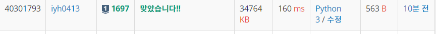

# [Baekjoon] 1697. 숨바꼭질 [S1]

## 📚 문제

https://www.acmicpc.net/problem/1697

---

최단 시간을 찾아야 한다. 따라서 **BFS 탐색**을 활용한다. deque 자료구조를 활용한다.

동생의 위치가 0부터 100000까지 올 수 있다. 왜냐하면 -1, +1, *2를 활용해 어떤 수를 나타낼 때 그 수를 넘지 않고 최단 경우의 수를 찾을 수 있다. 

정점을 확인하면 그 수의 -1, +1 *2의 정점이 현재 방문했는지 확인하고 방문하지 않았으면 이전 정점에 담겨있는 값에 1을 더한다.

동생이 있는 위치가 나오면 출력한다.

## 📒 코드

```python
from collections import deque


a, b = map(int, input().split())
visited = [-1 for _ in range(100001)]
queue = deque()
queue.append(a)
visited[a] = 0
while visited[b] == -1:
    v = queue.popleft()
    if v + 1 <= 100000 and visited[v + 1] == -1:
        visited[v + 1] = visited[v] + 1
        queue.append(v + 1)
    if v - 1 >= 0 and visited[v - 1] == -1:
        visited[v - 1] = visited[v] + 1
        queue.append(v - 1)
    if v * 2 <= 100000 and visited[v * 2] == -1:
        visited[v * 2] = visited[v] + 1
        queue.append(v * 2)

print(visited[b])
```

## 🔍 결과

