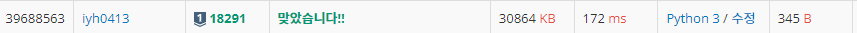

# [Baekjoon] 18291. 비요뜨의 징검다리 건너기 [S1]

## 📚 문제

https://www.acmicpc.net/problem/18291

---

예제 입력인 작은 케이스부터 살펴본다.

4는

>1 4
>
>1 2 4
>
>1 3 4
>
>1 2 3 4

4가지이다.

5는

> 1 5
>
> 12 5
>
> 1 3 5
>
> 1 4 5
>
> 1 2 3 5
>
> 1 2 4 5
>
> 1 3 4 5
>
> 1 2 3 4 5

8가지

3은

> 1 3
>
> 1 2 3

3은 2가지, 4는 4가지, 5는 8가지이니 N은 2^(N-2)가지이다.

10^9 + 7로 나눈 나머지를 출력하라고 하니 분할정복을 활용한 거듭제곱과 모듈러의 성질을 이용한다.

1과 2가 들어오는 경우는 위 식을 만족하지 않으니 따로 예외처리 해준다.

## 📒 코드

```python
T = int(input())

def pows(n, p):     # 분할정복을 활용한 n의 p 거듭제곱 값 구하기
    if p == 0:
        return 1
    else:
        x = pows(n, p // 2)
        x *= x
        x %= 1000000007     # 10^9 + 7로 나눈 값을 구해야하므로 모듈러의 성질을 이용해 연산과정마다 계산한다.
        if p % 2:
            return (x * n) % 1000000007
        else:
            return x

for _ in range(T):
    N = int(input())
    if N > 2:
        print(pows(2, N-2))
    else:           # N이 2이하일 때는 1이다.
        print(1)
```

## 🔍 결과

