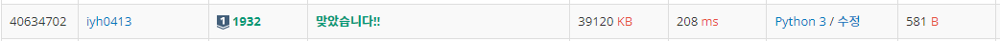

# [Baekjoon] 1932. 정수 삼각형 [S1]

## 📚 문제

https://www.acmicpc.net/problem/1932

---

## 📖 풀이

i는 다음 줄 i, i +1을 선택할 수 있다. 점화식으로 정리할 수 있으니 dp를 활용한다.

탑다운 방식의 재귀 백트래킹을 활용한다.

n번째 줄의 m번째 인덱스 값은 다음 행인 n + 1번째 줄의 m 인덱스의 값과 m + 1 인덱스 값 중 더 큰 값에 현재 인덱스의 값을 더해서 구한다. 구한 결과를 dp에 담아 이미 구했던 과정은 또 반복하지 않도록 한다.

- 점화식으로 나타내면 다음과 같다.

> `dp[n][m] = arr[n][m] + max(recur(n+1, m), recur(n+1, m+1))`

위 식을 간단히 재귀로 구현한다.

DP를 활용해 중복을 제거해서 풀어나가면 시간초과에서도 자유롭다.

바텀업 방식보단 탑다운 방식이 훨씬 간단하다.

## 📒 코드

```python
import sys
input = sys.stdin.readline


def recur(cur, i):  # 탑다운 백트래킹
    global max_result
    if cur == n:    # 끝까지 확인했으면 0을 리턴
        return 0

    if dp[cur][i] == -1:    # 계산하지 않았을 때
        dp[cur][i] = arr[cur][i] + max(recur(cur + 1, i), recur(cur + 1, i + 1))

    return dp[cur][i]   # 계산한 경우 바로 리턴


n = int(input().rstrip())
arr = [list(map(int, input().split())) for _ in range(n)]
dp = [[-1] * i for i in range(1, n + 1)]    # 똑같은 계산과정은 반복하지 않는다.
print(recur(0, 0))
```

## 🔍 결과

