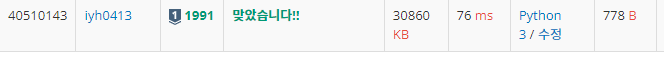

# [Baekjoon] 1991. 트리 순회 [S1]

## 📚 문제

https://www.acmicpc.net/problem/1991

---

**이진 트리 문제**

문자를 ord를 사용해 숫자로 바꿔준다.

A~Z까지 들어올 수 있으니 입력을 받을 때 람다함수를 이용해 ord('A')를 해주고 1부터 시작하기 위해 1을 더해준다.

그러면 A~Z => 1~26으로 바뀐다.

배열은 1~n이니 n+1만큼의 배열을 만들고 연결관계를 하나씩 표시해준다.

>- **전위순회(VLR)** : 부모노드 방문 후, 자식노드를 좌, 우 순서로 방문
>- **중위순회(LVR)** : 왼쪽 자식노드, 부모노드, 오른쪽 자식노드 순으로 방문
>- **후위순회(LRV)** : .자식노드를 좌우 순서로 방문한 후, 부모노드로 방문

다음을 재귀함수로 활용해 풀어본다.

## 📒 코드

```python
def pre_order(v):	# 전위순회
    if v:
        return chr(v + ord('A') - 1) + pre_order(arr[v][0]) + pre_order(arr[v][1])
    else:
        return ''
        
        
def in_order(v):	# 중위순회
    if v:
        return in_order(arr[v][0]) + chr(v + ord('A') - 1) + in_order(arr[v][1])
    else:
        return ''
        
        
def post_order(v):	# 후위순회
    if v:
        return post_order(arr[v][0]) + post_order(arr[v][1]) + chr(v + ord('A') - 1)
    else:
        return ''


n = int(input())
arr = [[0, 0] for _ in range(n + 1)]

for i in range(n):
    par, left, right = map(lambda x: ord(x) - ord('A') + 1 if x != '.' else 0, input().split())
    arr[par][0] = left
    arr[par][1] = right

print(pre_order(1))
print(in_order(1))
print(post_order(1))
```

## 📚 결과

