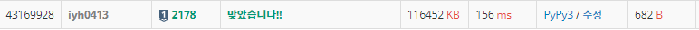

# [Baekjoon] 2178. 미로 탐색 [S1]

## 📚 문제 : [미로 탐색](https://www.acmicpc.net/problem/2178)

## 📖 풀이

최소의 칸 수로 도착하는 경우를 구해야하니 BFS로 구한다.

움직일 때마다 초기위치에서 넓혀나가는 칸 수를 세야하니, BFS에서 큐의 size를 잰 후 size의 크기만큼 pop하면서 depth를 세 준다.

마지막 구간에 도착했을 때 depth를 출력한다.

## 📒 코드

```python
from collections import deque

def in_range(x, y):
    return 0 <= x < n and 0 <= y < m

n, m = map(int, input().split())
arr = [input() for _ in range(n)]
visited = [[0] * m for _ in range(n)]
dx = [0, 1, 0, -1]
dy = [1, 0, -1, 0]
que = deque()
que.append([0, 0])
visited[0][0] = 1

cnt = 1
while que:
    sz = len(que)
    for _ in range(sz):
        x, y = que.popleft()
        if x == n - 1 and y == m - 1:
            print(cnt)
        for i in range(4):
            nx = x + dx[i]
            ny = y + dy[i]
            if in_range(nx, ny) and arr[nx][ny] == '1' and visited[nx][ny] == 0:
                visited[nx][ny] = 1
                que.append([nx, ny])
    cnt += 1
```

## 🔍 결과

