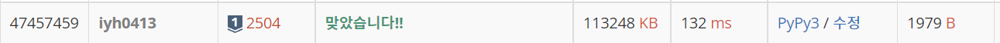

# [Baekjoon] 2504. 괄호의 값 [S1]

## 📚 문제 : [괄호의 값](https://www.acmicpc.net/problem/2504)

## 📖 풀이

내가 생각한 해결법은 다음과 같다.

여는 괄호와 닫는 괄호가 만나면 숫자로 바꾼다.

- 닫는 괄호일 때 스택 맨 위에 여는 괄호가 있으면 숫자로 바꿔 넣어준다. `()`이면 2, `[]`이면 3

숫자와 숫자가 만나면 더한다.

- 스택 맨 위에 숫자가 있으면 더한 후 스택에 담고, 숫자가 없으면 그냥 스택에 넣어준다.

숫자가 괄호에 둘러쌓여 있으면 곱한다.

- 이게 조금 까다로운데, 닫는 괄호가 나왔을 때 숫자가 스택에 있으면 한 번 더 꺼낸다. 그리고 여는 괄호가 나오면 곱해주고 아니면 다시 스택에 다 담아준다.

위 세 가지로 해결한다.

전체적으로 위 과정을 계속 반복하여 숫자가 하나 남을 때, 그 값을 출력한다.


위 과정에서 에러를 찾기란 어렵다. 따라서 처음에 괄호가 유효한 지부터 따로 체크한다. 그리고 점수를 센다.

점수를 세는 과정에서 에러가 발생할 수 있는 상황은 stack이 비어있을 때이다.

top을 확인하거나 pop을 할 때 stack이 비어있으면 에러나니 이러한 상황을 잘 확인해야 한다.

## 📒 코드

```python
# 괄호가 정상인지 확인
def check():
    stack = []
    for c in string:
        if c in '[(':
            stack.append(c)
        elif c == ']':
            if not stack or stack.pop() != '[':
                return False
        elif c == ')':
            if not stack or stack.pop() != '(':
                return False
    if stack:
        return False
    else:
        return True


# 괄호 점수 세기
def score_counting():
    arr = string[:]
    while len(arr) != 1:
        stack = []
        for c in arr:
            if c == ['(', '[']:
                stack.append(c)
            elif c not in gwalho:   # 숫자가 나올 경우
                if not stack:
                    stack.append(c)
                elif stack[-1] not in gwalho:     # 숫자가 스택에 있으면 곱해준다.
                    stack.append(stack.pop() + int(c))
                else:
                    stack.append(c)
            else:
                if c == ']':
                    if stack[-1] == '[':
                        stack.pop()
                        stack.append(3)
                    elif (stack[-1] not in gwalho) and stack[-2] == '[':
                        num = stack.pop()
                        stack.pop()
                        stack.append(num * 3)
                    else:
                        stack.append(c)
                elif c == ')':
                    if stack[-1] == '(':
                        stack.pop()
                        stack.append(2)
                    elif (stack[-1] not in gwalho) and stack[-2] == '(':
                        num = stack.pop()
                        stack.pop()
                        stack.append(num * 2)
                    else:
                        stack.append(c)
                else:
                    stack.append(c)
        arr = stack[:]
    return arr[0]


gwalho = ['[', '(', ']', ')']
string = input()
if not check():
    print(0)
else:
    print(score_counting())

```

## 🔍 결과


