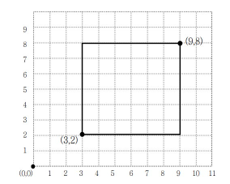
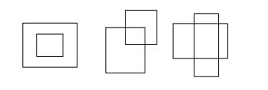
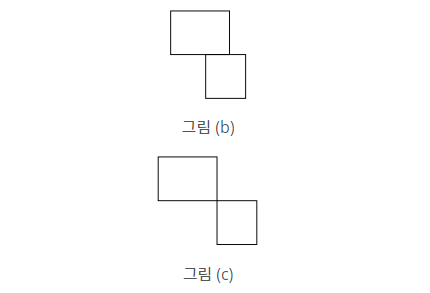
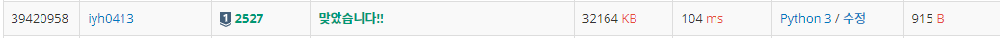

# [Baekjoon] 2527. 직사각형 [S1]

## 📚 문제

https://www.acmicpc.net/problem/2527

---



위와 같이 왼쪽 아래 꼭짓점과 오른쪽 위 꼭짓점 좌표가 주어진다.



다음과 같이 겹쳐지는 모양이 사각형이면 a 출력



선분이 겹쳐지면 b 출력, 점이 겹치면 c를 출력한다.

겹쳐지는 부분이 없으면 d를 출력한다.

**x의 범위**와 **y의 범위**로 생각하여 해결해본다.(50001 길이의 list 생성, 1 추가는(padding))

첫번째 직사각형의 x의 범위만큼 리스트에 1로 담아준다.

두번째 직사각형의 x의 범위에서 리스트를 겹치며 1이 있는지 확인한다.

1이 하나 있으면 점, 2개가 나오면 어차피 더 볼 필요가 없이 선이니 break

y도 마찬가지로 해결한다.

>x범위가 안 겹치거나 또는 y범위가 안 겹치면 겹치는 부분이 없다.
>
>둘 다 점으로 겹치면 점이다.
>
>하나는 점 하나는 선으로 겹치면 선분이다.
>
>둘 다 선으로 겹치면 면(직사각형)이다.

## 📒 코드

```python
for tc in range(4):
    arr = list(map(int, input().split()))
    r1 = arr[0:4]   # 첫번째 직사각형
    r2 = arr[4:8]   # 두번째 직사각형
    x_paint = [0 for _ in range(50001)] # x영역 초기화
    y_paint = [0 for _ in range(50001)] # y영역 초기화
    x_status = 0    # 0이면 안 겹침, 1이면 점으로 겹침, 2이면 선으로 겹침
    y_status = 0

    for i in range(r1[0], r1[2] + 1):   # r1의 x영역을 색칠
        x_paint[i] = 1
    for i in range(r2[0], r2[2] + 1):   # r1의 x영역 중 r2랑 겹치는 구간이 있는지 비교
        if x_paint[i] == 1:             # 처음에 한 번 겹치면 점
            x_status += 1
            if x_status == 2:           # 겹치는게 2개 이상이면 선, 더 볼 필요 없으니 break
                break

    for i in range(r1[1], r1[3] + 1):   # 위와 같은데 y영역
        y_paint[i] = 1
    for i in range(r2[1], r2[3] + 1):
        if y_paint[i] == 1:
            y_status += 1
            if y_status == 2:
                break

    if x_status and y_status:           # x, y가 둘 다 겹치는 부분이 있을 때
        if x_status + y_status == 2:    # 둘 다 점으로 겹치니 c 출력
            print('c')
        elif x_status + y_status == 3:  # 하나는 점 하나는 선으로 겹치면 사각형은 선분이 겹치니 b 출력
            print('b')
        else:                           # 나머지는 사각형(면)으로 겹치니 a 출력
            print('a')
    else:                               # 겹치는 부분이 없으면 d 출력
        print('d')
```

## 🔍 결과

