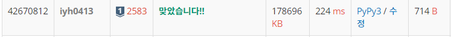

# [Baekjoon] 2583. 영역 구하기 [S1]

## 📚 문제 : [영역 구하기](https://www.acmicpc.net/problem/2583)

---

## 📖 풀이

직사각형으로 이루어진 부분을 1로 칠하고 0인 부분의 연결 요소를 구하면 된다.

연결 요소의 넓이를 구해야하니 확장될 때마다 넓이를 기억한다.

DFS나 BFS 모두 사용가능한데 DFS로 해결해본다.

dfs에서 영역의 넓이를 구해야하니 현재 값을 더해줘야 하니 cnt에 1을 더하고, 네 방향으로 탐색하면서 있는 값을 더한다. 즉, 탑다운 방식으로 해결하였다.

## 📒 코드

```python
import sys
sys.setrecursionlimit(10000)

def dfs(x, y):
    visited[x][y] = 1

    cnt = 1     # 영역의 크기에 현재 값을 더해준다.
    for i in range(4):
        nx = x + dx[i]
        ny = y + dy[i]       
        if 0 <= nx < n and 0 <= ny < m and visited[nx][ny] == 0:
            cnt += dfs(nx, ny)  # 네 방향으로의 크기를 더해준다.
    return cnt


dx = [0, 1, 0, -1]
dy = [1, 0, -1, 0]
m, n, k = map(int, input().split())
visited = [[0] * m for _ in range(n)]

for _ in range(k):      # 직사각형의 영역을 1로 다 만들어준다.
    x0, y0, x1, y1 = map(int, input().split())
    for i in range(x0, x1):
        for j in range(y0, y1):
            visited[i][j] = 1

result = []
for i in range(n):
    for j in range(m):
        if visited[i][j] == 0:
            result.append(dfs(i, j))    # 영역의 크기를 result에 담는다.

print(len(result))  # 영역의 개수
print(*sorted(result))  # 영역의 크기를 정렬하여 출력
```

## 🔍 결과

