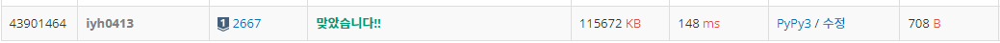

# [Baekjoon] 2667. 단지번호붙이기 [S1]

## 📚 문제 : [단지번호붙이기](https://www.acmicpc.net/problem/2667)

## 📖 풀이

연결요소를 구하는 문제이다.

DFS나 BFS로 구하면 된다. BFS로 구현해본다.

연결된 정점을 하나씩 찾으며 꺼낸 경우 0으로 바꿔준다. 그리고 cnt를 1씩 증가시키며 총 연결 요소의 개수를 구한다.

하나의 연결 요소를 구할 때마다 연결된 정점들의 개수를 리스트에 담고, 개수를 출력하고 정렬하여 하나씩 출력한다.

## 📒 코드

```python
from collections import deque


def bfs(a, b):
    que = deque()
    que.append([a, b])
    arr[a][b] = 0
    cnt = 0
    while que:
        cnt += 1
        x, y = que.popleft()
        for i in range(4):
            nx = x + dx[i]
            ny = y + dy[i]
            if 0 <= nx < n and 0 <= ny < n and arr[nx][ny]:
                arr[nx][ny] = 0
                que.append([nx, ny])
    return cnt


n = int(input())
arr = [list(map(int, input())) for _ in range(n)]
dx = [0, 1, 0, -1]
dy = [1, 0, -1, 0]
result = []

for i in range(n):
    for j in range(n):
        if arr[i][j]:
            result.append(bfs(i, j))

print(len(result))
result.sort()
for i in range(len(result)):
    print(result[i])
```

## 🔍 결과

