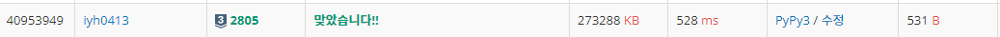

# [Baekjoon] 2805. 나무 자르기 [S3]

## 📚 문제

https://www.acmicpc.net/problem/2805

---

## 📖 풀이

나무의 높이의 최댓값을 출력하는 문제이니 **이진 탐색** 문제이다.

나무의 높이에 대해 예제를 표로 정리해본다.

- Input

```
4 7
20 15 10 17
```

각 높이로 자르는 경우 얻을 수 있는 나무의 수와 가능한지 적는다.

나무를 자를 때 음수는 없다!!

| 높이      | 1    | 2    | 3    | 4    | ...  | 14   | 15   | 16   | 17   |
| --------- | ---- | ---- | ---- | ---- | ---- | ---- | ---- | ---- | ---- |
| 나무      | 58   | 54   | 50   | 46   | ...  | 10   | 7    | 5    | 3    |
| 가능 여부 | o    | o    | o    | o    | ...  | o    | o    | x    | x    |

표로 정리해보면 15일 때가 가장 최댓값이다.

따라서 이진탐색으로 탐색하며 나무의 개수가 가능하면 s를 mid + 1로 바꾸고, 가능하지 않으면 e를 mid - 1로 바꾸면서 탐색한다.

s가 e보다 커지면 종료한다.

## 📒 코드

```python
def check(x):
    total = 0
    for i in range(n):
        total += max(0, arr[i] - x)     # 음수일 땐 0으로!
    return total >= m                   # 가능한지 확인

n, m = map(int, input().split())
arr = list(map(int, input().split()))

s = 0
e =  1_000_000_000
ans = 0
while s <= e:
    mid = (s + e) // 2
    if check(mid):          # 가능하면 mid 왼쪽을 날린다.
        ans = mid
        s = mid + 1
    else:                   # 불가능하면 mid 오른쪽을 날린다.
        e = mid - 1
print(ans)
```

## 🔍 결과

