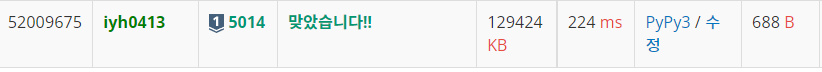

# [Baekjoon] 5014. 스타트링크 [S1]

## 📚 문제 : [스타트링크](https://www.acmicpc.net/problem/5014)

## 📖 풀이

엘리베이터에 u칸 올라갈 수 있는 U버튼과 d칸 내려갈 수 있는 D버튼 2가지가 존재한다.

엘리베이터에서 U버튼과 D버튼을 눌러 특정 G층에 도달할 수 있는지 찾는 문제이다.

그리고 그 때 최소로 눌러야 하는 횟수를 출력하고 누를 수 없으면 'use the stairs'를 출력한다.

**bfs**를 활용하면 된다.

특정 층에서 d와 u버튼을 눌러 이동할 수 있는 층을 visited 배열에 방문 표시를 해준다. 그리고 bfs의 depth를 확인해 그 때의 depth를 출력하면 그게 버튼을 누르는 횟수이다.

갈 수 없는지 확인하기 위해 visited 배열에 F층까지 표시할 수 있도록 하고, 큐에 값이 없어질 때까지 찾고, 찾을 수 없을 때 'use the stairs'를 출력한다.

## 📒 코드

```python
from collections import deque


def in_range(x):
    return 0 < x <= F


def bfs():
    que = deque()
    que.append(S)
    d = 0
    while que:
        sz = len(que)
        for _ in range(sz):
            node = que.popleft()
            if node == G:
                return d
            if in_range(node + U) and visited[node + U] == 0:
                visited[node + U] = 1
                que.append(node + U)
            if in_range(node - D) and visited[node - D] == 0:
                visited[node - D] = 1
                que.append(node - D)
        d += 1
    return 'use the stairs'


F, S, G, U, D = map(int, input().split())
visited = [0 for _ in range(F + 1)]
print(bfs())
```

## 🔍 결과

