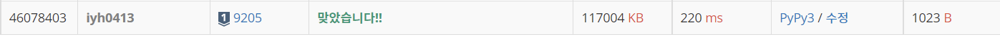

# [Baekjoon] 맥주 마시면서 걸어가기 [S1]

## 📚 문제 : [맥주 마시면서 걸어가기](https://www.acmicpc.net/problem/9205)

## 📖 풀이

편의점에 들리면 맥주병을 살 수 있다. 최대 20병이니 다음 편의점까지 거리가 20병 x 50미터인 1000미터 이내여야 들릴 수 있다.

BFS로 풀어본다. 상근이 집을 큐에 먼저 담고, 큐에서 꺼낸 좌표에서 1000미터 이내인 갈 수 있는 편의점을 담아나간다.

펜타포트 락 페스티벌에 갈 수 있다면 happy를 갈 수 없다면 sad를 출력한다.

봤던 편의점은 또 확인하지 않기 위해 방문표시를 해준다.

## 📒 코드

```python
from collections import deque


def go(a, b):       # 갈 수 있는지 판단
    dist = abs(a[0] - b[0]) + abs(a[1] - b[1])
    if dist <= 1000:
        return True
    else:
        return False


t = int(input())
for _ in range(t):
    n = int(input())
    house = list(map(int, input().split()))
    stores = [[] for _ in range(n)]
    for i in range(n):
        stores[i] = list(map(int, input().split()))
    festival = list(map(int, input().split()))
    visited = [0 for _ in range(n)]     # 편의점을 방문했는지 표시
    result = 'sad'
    que = deque()
    que.append(house)
    while que:
        place = que.popleft()
        if go(place, festival):
            result = 'happy'
            break
        for i in range(n):
            if visited[i]:      # 이미 방문한 편의점인지 파악
                continue
            if go(place, stores[i]):        # 갈 수 있는 편의점이 있으면 이동
                visited[i] = 1
                que.append(stores[i])
    print(result)
```

## 🔍 결과

