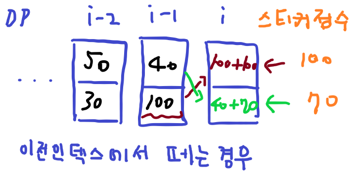
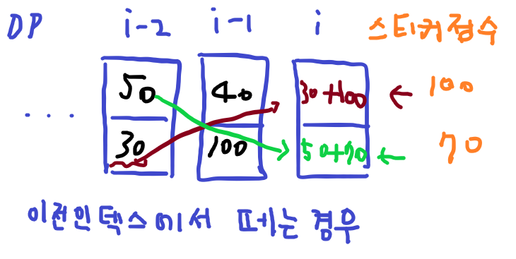
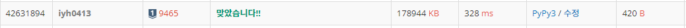

# [Baekjoon] 9465. 스티커 [S1]

## 📚 문제 : [스티커](https://www.acmicpc.net/problem/9465)

---

## 📖 풀이

n이 100000이니 백트래킹을 활용하면 안된다! DP로 생각해보기 위해 직접 적어가며 점화식을 찾아본다.

- 예제 Input

```
5
50 10 100 20 40
30 50 70 10 60
```

스티커 순서대로 현재 기준 최댓값을 DP에 적어나간다. 다음 값들이 위, 아래에 영향을 받으므로 3차원으로 DP 값을 적어줘야 한다.

| index    | 0    | 1    | 2    | 3    | 4    |
| -------- | ---- | ---- | ---- | ---- | ---- |
| 위       | 50   | 10   | 100  | 20   | 40   |
| 아래     | 30   | 50   | 70   | 10   | 60   |
| dp(위)   | 50   | 40   | 200  | 140  | 250  |
| dp(아래) | 30   | 100  | 120  | 210  | 260  |

dp 값을 구할 때 현재 값 기준 이전 인덱스에서 스티커를 떼는 경우와 안 떼는 경우로 비교해볼 수 있다.

---

1. 이전 인덱스에서 스티커를 떼는 경우



이전 인덱스에서 떼는 경우는 대각선으로만 선택할 수 있으니 대각선 값에 현재 스티커 값을 더하면 된다.

---

2. 이전 인덱스에서 스티커를 떼지 않는 경우



인덱스를 하나 건너 뛰고 대각선 값을 가져와 더해주면 된다. 같은 라인에 있는 값은 보지 않는다. 왜냐면 어차피 이전 인덱스에서 스티커를 떼는 경우에서 대각선 값이 더해진 것이라 무조건 더 작은 값이니 비교할 필요가 없다.

---

따라서 점화식으로 적어보면 다음과 같다.

스티커 값은 `arr[]`에 저장하고 DP는 `dp[]`에 저장한다.

> `dp[0][i] = arr[0][i] + max(dp[1][i - 1], dp[1][i - 2])` 
>
> `dp[1][i] = arr[1][i] + max(dp[0][i - 1], dp[0][i - 2])`

dp를 다 채운 후 마지막 인덱스의 dp 값 2개 중 큰 값을 출력한다.

## 📒 코드

```python
t = int(input())
for _ in range(t):
    n = int(input())
    arr = [list(map(int, input().split())) for _ in range(2)]
    dp = [[0] * n for _ in range(2)]

    for i in range(0, n):
        dp[0][i] = arr[0][i] + max(dp[1][i - 1] if i >= 1 else 0, dp[1][i - 2] if i >= 2 else 0)
        dp[1][i] = arr[1][i] + max(dp[0][i - 1] if i >= 1 else 0, dp[0][i - 2] if i >= 2 else 0)

    print(max(dp[0][n - 1], dp[1][n - 1]))
```

## 🔍 결과

