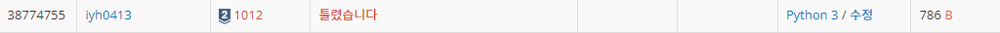
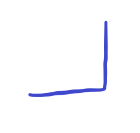
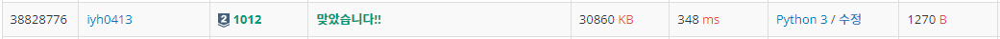

# [Baekjoon] 1012. 유기농 배추[S2]

문제: https://www.acmicpc.net/problem/1012

---

가로로 한 줄씩 왼쪽에서 오른쪽으로 읽고 0이 아닌 수가 나오면, 연속으로 0이 아닌 수가 나오는지 확인한다. 연속으로 나오면 그 다음 1들은 2를 적는다.

세로로 한 줄씩 위에서 아래로 읽고 0이 아닌 수가 나오면, 연속으로 0이 아닌 수가 나오는지 확인한다. 연속으로 나오면 그 다음 1들은 2를 적는다.

1차 제출 코드(틀렸다):

```python
T = int(input()) # T는 테스트 케이스 수

for _ in range(T):
    M, N, K = map(int,input().split()) # M은 가로길이, N은 세로길이, K는 배추 위치의 개수

    lst = [[0 for _ in range(M)] for _ in range(N)] # 배추밭을 2차원 lst로 초기화
    for i in range(K):
        X, Y = map(int, input().split())    # X,Y는 배추의 좌표
        lst[Y][X] = 1   # 배추를 배추밭에 1로 표기
    
    for i in range(N):
        for j in range(M):
            if lst[i][j] == 1:
                if ((j != 0) and (lst[i][j-1] != 0)) or ((i != 0) and (lst[i-1][j] != 0)):
                    lst[i][j] = 2
    
    result = 0

    for i in range(N):
        for j in range(M):
            if lst[i][j] == 1:
                result += 1
    
    print(result)
```

결과:



틀렸다..




이렇게 배추가 생기면 안된다!! 하나가 아닌 꼭짓점 2개를 출력해버린다.

좀 더 깊게 생각해보자..

---

1을 만나면 애벌레 1마리 올리고, 1에 인접해 있는 1들을 모두 0으로 바꾼다.

1에 인접하는 1을 만나면 또 그 주위 네방향으로 조사한다. 이 과정을 반복한다.

중간에 리스트 복사를 위해 `list[:]` 리스트 슬라이싱으로 복사한다.

코드:

```python
T = int(input()) # T는 테스트 케이스 수

for _ in range(T):
    M, N, K = map(int,input().split()) # M은 가로길이, N은 세로길이, K는 배추 위치의 개수

    lst = [[0 for _ in range(M+2)] for _ in range(N+2)] # 배추밭을 2차원 lst로 초기화
    # 테두리를 추가해 인덱스 초과 error를 없앤다.

    for i in range(K):
        X, Y = map(int, input().split())    # X,Y는 배추의 좌표
        lst[Y+1][X+1] = 1   # 배추를 배추밭에 1로 표기

    result = 0  # 애벌레 개수
    
    dir = [(1,0), (-1,0), (0,1), (0,-1)] # 네 방향 인덱스

    for i in range(1, N+1):
        for j in range(1, M+1):
            if lst[i][j] == 1:  # 1을 만났을 때
                result += 1 # 애벌레를 하나 더한다.
                lst[i][j] = 0   # 1을 만나면 다 0으로 바꾼다.
                node = []   # 1을 만났을 때 주위 네 방향을 담을 리스트
                for y, x in dir:    # 현재 인덱스 중심으로 네 방향으로 움직인 인덱스를 node에 담는다.
                    node.append((i+y, j+x))
                while len(node) > 0:    # 비교할 노드가 있으면 계속한다.
                    node2 = []
                    for k in range(0,len(node)):                   
                        y1, x1 = node[k]
                        if lst[y1][x1] == 1:
                            lst[y1][x1] = 0
                            for y2,x2 in dir:   # 현재 인덱스 기준 다시 네 뱡향으로 조사한다.
                                node2.append((y1+y2, x1+x2))
                    node = node2[:] # 리스트를 복사할 때 슬라이싱을 활용한다.

    print(result)
```

결과:



좀 결과가 길다. 찾아보니 **BFS**라는 방법을 사용하는 것 같다.

BFS를 공부해 BFS 방법으로도 풀어보자!
