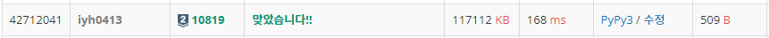

# [Baekjoon] 10819. 차이를 최대로 [S2]

## 📚 문제 : [차이를 최대로](https://www.acmicpc.net/problem/10819)

---

## 📖 풀이

**중복없는 순열** 문제이다. 그냥 가지치기 없이 구하면 `8!`이니 시간초과가 발생하지 않는다. 따라서 가지치기 없이 해결한다.

순열로 수를 하나씩 선택하면서 차이 값을 계산해서 더해준다. 처음에 값을 넣는 경우만 이전 값이 없으므로, 차이 값을 계산하지 않는다. 다음 값부터는 이전 값과의 차이를 구해야하니 prv 인자를 하나 만들어서 이전 값을 기억한다.

최종적으로 total 값이 최대인 값을 출력한다.

## 📒 코드

```python
def recur(cur, total, prv):
    global max_total
    if cur == n:
        max_total = max(max_total, total)
        return
    
    for i in range(n):
        if visited[i]:
            continue
        visited[i] = 1
        if cur:
            recur(cur + 1, total + abs(prv - arr[i]), arr[i])
        else:
            recur(cur + 1, total, arr[i])
        visited[i] = 0


n = int(input())
arr = list(map(int, input().split()))
visited = [0 for _ in range(n)]
max_total = 0
recur(0, 0, 0)
print(max_total)
```

## 🔍 결과

